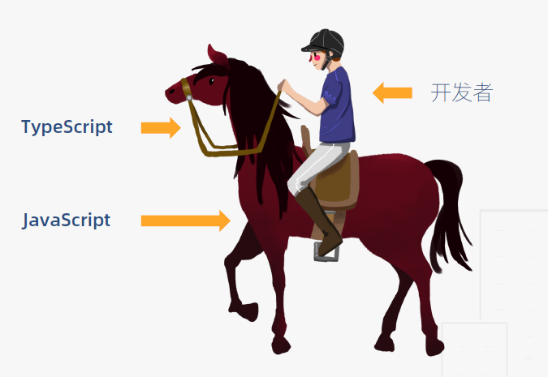

# 认识 TypeScript

## TypeScript 缘起

JavaScript 是一门动态弱类型语言，对变量的类型非常宽容，而且不会在这些变量和它们的调用者之间建立结构化的契约。

JS 前端开发的短板之一：长期在没有类型约束的环境下开发，造成类型思维的缺失，养成不良的编程习惯。

任何一门技术的出现都是为了解决某些问题。为了应对 JavaScript 越来越广泛和复杂的开发需求，这门语言需要更高的健壮性和可维护性。而 ECMAScript 标准在类型检查方面尚无建树，TypeScript 应运而生。它主要用于解决以下场景：

- 引入其他函数时，无法确定参数类型
- 为了代码的健壮性，对一个函数的输入参数进行各种假设
- 优化参数类型时，不知道有多少处引用，联调时报 `TypeError` 错误

以上问题都是因为 JavaScript 是一门动态弱类型语言。如果长期在没有类型约束的环境下开发，就会造成"类型思维"的缺失，养成不良的编程习惯。这也是做前端开发的短板之一，值得警醒。

开源社区给出的解决方案主要有两种，一是 2014 年 Facebook 推出的 Flow ，还有一个是微软推出的 TypeScript 。它们都致力于为 JavaScript 提供**静态类型检查**。在市场的考验下，显然 TypeScript 活得更好。例如 Angular 和 Vue 使用 TypeScript 重构代码，Facebook 自家的 Jest 和 Yarn 都在从 Flow 向 TypeScript 迁移。在 ECMAScript 推出静态类型检查之前，可以说 TypeScript 是当前解决此问题的最佳方案。

## 什么是 TypeScript？

[TypeScript](https://github.com/Microsoft/TypeScript) 是一种由微软开发的自由和开源的编程语言，它是 JavaScript 的一个超集，扩展了 JavaScript 的语法。

官方对 TypeScript 的定义是：拥有类型系统的 JavaScript 超集，可以编译成纯 JavaScript 语言。它主要有一下三大特点：

- 类型检查

  TypeScript 在编译时进行严格的静态类型检查，意味着可以在编码阶段发现可能存在的隐患，而不必带到线上。

- 语言扩展

  TypeScript 会包括 ES6 及未来提案中的特性，如异步操作和装饰器。也会从其他语言借鉴某些特性，比如接口和抽象类。

- 工具属性

  TypeScript 可以编译成标准 JavaScript，可以在任何浏览器和操作系统上运行，无需运行时的额外开销，从这点讲，TypeScript 更像是一个工具，而不是一门独立的语言。

## 为什么使用 TypeScript？

借助 VSCode 的自动补全、导航和重构功能，使得接口定义可以直接代替文档，同时也可以提高开发效率，降低维护成本。

TypeScript 可以帮助重塑"类型思维"，接口的提供方将被迫去思考 API 的边界，他们将从代码的编写者蜕变为代码的设计者。

## 使用 TypeScript 的好处

- 接口定义替代文档
- IDE 能够提高开发效率，降低维护成本
- 重塑"类型思维"
