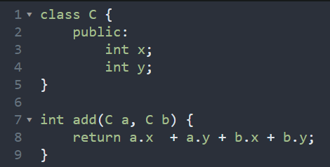

# 类型基础

## 强类型与弱类型语言

在强类型语言中，当一个对象从调用函数传递到被调用时，其类型必须与被调用函数中声明的类型兼容。 -- `Liskov,Zilles 1974`

### 强类型

通俗定义：强类型语言不允许改变变量的数据类型，除非进行强制类型转换。

示例：以 Java 为例

### 弱类型

在弱类型语言中，变量可以被赋予不同的数据类型。

示例：以 JS 为例

## 静态类型语言与动态类型语言

- 静态类型语言：在编译阶段确定所有变量的类型
- 动态类型语言：在执行阶段确定所有变量的类型

JS：

C++：

JS 与 C++ 对比：

### 静态类型与动态类型对比

## 其他定义

强类型语言：不允许程序在发生错误后继续执行。

`那么`：争议：C/C++ 是强类型还是弱类型？

## 语言类型象限

思考：如果把 TS 当做一门语言来看待，那么他是强类型还是弱类型？是静态类型还是动态类型呢？
