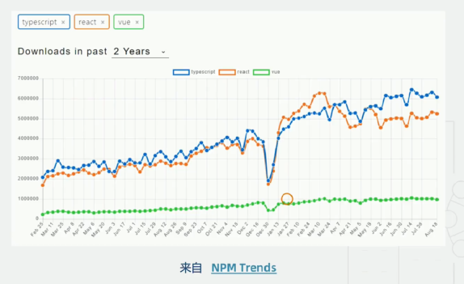
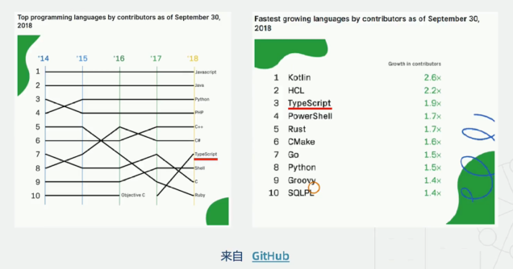
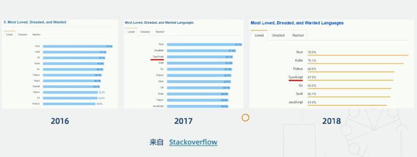
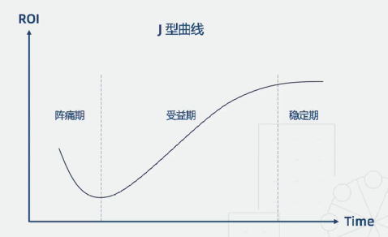

# TypeScript 现状及未来，是否该学习？

## TypeScript 的现状

关注程度：

使用情况：

使用后的评价：

## TypeScript 的未来

TypeScript 的未来会怎样？它能火多久？会不会被标准替代？该不该学？...

1. 世界充满了不确定性
1. 不必关注某种语言或者工具的兴衰，要看前端发展的大势
1. 大势：JavaScript 一直在向语言象限的右上角拼命挣扎
1. 关键：**学习类型思维，补齐前端短板**
1. TS -> 事实标准? -> ES 标准?
1. ...

## TypeScript 的 ROI (投入产出比)

收益：

1. 提升代码质量
1. 增强代码可维护性
1. 提升开发效率
1. 重塑类型思维
1. ...

成本：

1. 思维转换
1. 对接现有开发生态
1. 项目迁移
1. 接口、声明文件的维护
1. ...

## 后面篇章的内容

基础篇

- 类型基础概念
- 语言特性
- 类型检查机制
- 高级类型应用场景

工程篇

- 工程配置
- 开发生态演化过程

配置篇

- tsconfig.json
- ESLint

实战

- 主流框架最佳实践
- 迁移策略
