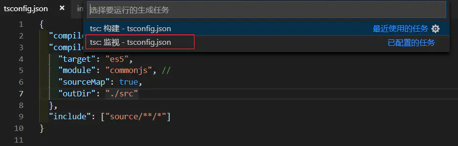

# 文件选项

在基础篇中有简单介绍过 `tsconfig.json` 文件，这里再回顾一下。

## 回顾

如果一个目录下存在一个 `tsconfig.json` 文件，那么它意味着这个目录是 TypeScript 项目的根目录。`tsconfig.json` 文件中指定了用来编译这个项目的根文件和编译选项。 一个项目可以通过以下方式之一来编译：

- 不带任何输入文件的情况下调用 `tsc`，编译器会从当前目录开始去查找 `tsconfig.json文` 件，逐级向上搜索父目录。
- 不带任何输入文件的情况下调用 `tsc`，且使用命令行参数 `--project`（或 `-p` ）指定一个包含 `tsconfig.json` 文件的目录。

当命令行上指定了输入文件时，tsconfig.json 文件会被忽略。

## files

它的含义是编译器需要编译的相对或绝对文件路径的单个文件列表。

```json
{
  "files": ["src/index.ts"]
}
```

这时执行 `tsc` 命令，编译器会编译 `src/index.ts` 文件。

## include

它的含义是编译器需要编译的文件或者目录。

```json
{
  "include": ["src"]
}
```

这时执行 `tsc` 命令，编译器会编译 `src` 目录下的所有 `ts` 文件。

## exclude

它的含义是编译器需要排除的文件或者目录。默认会排除 `node_modules` 目录下的所有文件及所有的声明文件。

```json
{
  "exclude": ["src/lib"]
}
```

1. 如果 `files` 和 `includes` 都没有指定，编译器默认包含当前目录下所有的 `ts` 文件。（`.ts`、`.d.ts`、`.tsx`）
2. 如果 `exclude` 存在，`exclude` 配置优先级高于 `files` 和 `includes` 配置
3. `exclude` 和 `includes` 配置支持 glob 通配符：`*`、`?`、`**`

## extends

可以把一些配置抽离出一个配置文件，再 `tsconfig.json` 文件引入，方便以后管理与维护。

```json
// tsconfig.json

{
  "extends": "./base.json"
}
```

在主配置文件中，设置文件选项会覆盖调继承文件中的相同的配置项。

## compileOnSave

它可以让 IDE 在保存文件时，编译器自动编译。

```json
{
  "compileOnSave": true
}
```

## 在 vs code 中使用

### 1. 全局安装 Typescript

npm i -g typescript

### 2. 在项目根目录下新建 tsconfig.json

```js
{
  "compileOnSave": true,
  "compilerOptions": {
    "target": "es5",
    "module": "commonjs",
    "sourceMap": true,
    "outDir": "./dist" // 生成.js文件的目录
  },
  "include": ["src/**/*"] // 你的.ts文件的目录
}
```

### 3. 启动实时监控

在保持 tsconfig.json 文件处于编辑状态的情况下，按 ctrl+shift+b，选择监听命令：

然后，就可以编写.ts 文件了，当按下 ctrl+s 保存时，从.ts 到.js 的转换就自动完成了。



## 链接

- [了不起的 tsconfig.json 指南](https://www.imooc.com/article/305339?block_id=tuijian_wz)
- [TS Compiler Options](https://www.imooc.com/article/305339?block_id=tuijian_wz)
- [VScode tasks.json 和 launch.json 的设置](https://zhuanlan.zhihu.com/p/92175757)
- https://www.jianshu.com/p/6445f09a1829
