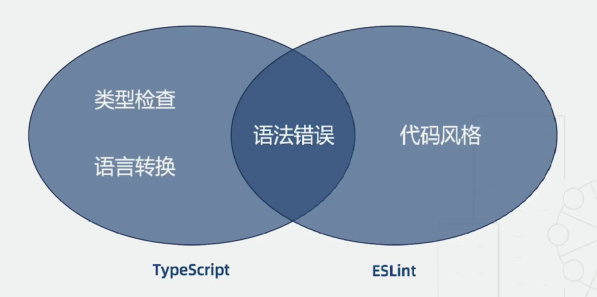
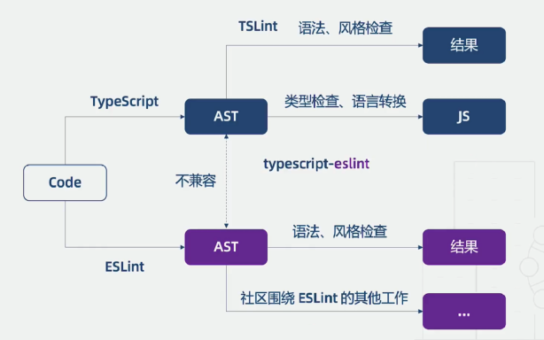
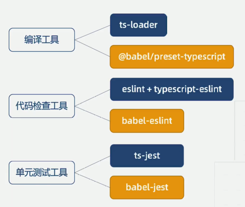

# TypeScript & ESLint

对于 Typescript 项目的编码规范而言，主要有两种选择 ESLint 和 TSLint。ESLint 不仅能规范 JS 代码，通过配置解析器，也能规范 TS 代码。此外由于性能问题，TypeScript 官方决定全面采用 ESLint，甚至把仓库作为测试平台，而 ESLint 的 TypeScript 解析器也成为独立项目，专注解决双方兼容性问题。

TypeScript 官方转向 ESLint 的原因：

1. TSLint 执行规则的方式存在一些架构问题，从而影响了性能，而修复这些问题会破坏现有的规则；
2. ESLint 的性能更好，并且社区用户通常拥有 ESLint 的规则配置（比如针对 React 和 Vue 的规则）, 而不会拥有 TSLint 的规则配置。

**使用了 TypeScript，为什么还需要 ESLint ？**





## label-eslint 与 typescript-eslint

- label-eslint：支持 TypeScript 没有的额外的语法检查，抛弃 TypeScript ，不支持类型检查
- typescript-eslint：基于 TypeScript 的 AST，支持创建基于类型信息的规则(tsconfig.json)

**建议**：

1. 两者底层机制不一样，不要一起使用，
2. Babel 体系建议使用 label-eslint，否则可以使用 typescript-eslint

## TypeScript 工具体系



以下主要介绍：

1. 用 ESLint 来规范 Typescript 代码
2. 用 ESLint 来规范 React 代码
3. 在 Webpack 中配置 ESLint

## 用 ESLint 来规范 Typescript 代码

**第一步：安装相关依赖包**

```bash
$ yarn add -D eslint @typescript-eslint/parser @typescript-eslint/eslint-plugin
```

- eslint: ESLint 核心代码
- @typescript-eslint/parser：ESLint 的解析器，用于解析 TypesSript，从而检查和规范 TypeScript 代码
- @typescript-eslint/eslint-plugin：这是一个 ESLint 插件，包含了各类定义好的检测 TypeScript 代码的规范

**第二步：修改 .eslintrc.js 文件**

在项目根目录下创建 `eslint` 配置文件，这里介绍 `.eslintrc.js` 文件配置。

```js
module.exports = {
  parser: '@typescript-eslint/parser', // 定义 ESLint 的解析器
  extends: ['plugin:@typescript-eslint/recommended'], // 定义文件继承的子规范
  plugins: ['@typescript-eslint'], // 定义所依赖的插件
  env: {
    // 指定代码的运行环境
    browser: true,
    node: true,
  },
};
```

.eslintrc.json

```json
{
  "parser": "@typescript-eslint/parser",
  "plugins": ["@typescript-eslint"],
  "parserOptions": {
      "project": "./tsconfig.json"
  },
  "extends": [
    "plugin:@typescript-eslint/recommended"
  ],
  "rules": {
    "@typescript-eslint/no-inferrable-types": "off"
  }
}
```

- 在 TS 项目中必须执行解析器为 `@typescript-eslint/parser`，才能正确的检测和规范 TS 代码
- env 环境变量配置，如 `console` 属性只有在 browser 环境下才会存在，如果没有设置支持 browser，那么可能报 console is undefined 的错误。

package.json

```js
eslint src --ext .js,.ts
```

## 用 ESLint 来规范 React 代码

如果你的项目为 React + TypeScript 的，可以按照以下步骤来配置 `eslint`。

**第一步：安装相关依赖包**

```bash
$ yarn add -D eslint-plugin-react
```

**第二步：修改 .eslintrc.js 文件**

```js
module.exports = {
  parser: '@typescript-eslint/parser',
  extends: [
    // 使用推荐的 React 代码检测规范
    'plugin:react/recommended',
    'plugin:@typescript-eslint/recommended',
  ],
  plugins: ['@typescript-eslint'],
  env: {
    browser: true,
    node: true,
  },
  settings: {
    // 自动发现 React 版本，从而进行规范 React代码
    react: {
      pragma: 'React',
      version: 'detect',
    },
  },
  parserOptions: {
    // 指定 ESLint 可以解析 JSX语法
    ecmaVersion: 2019,
    sourceType: 'module',
    ecmaFeatures: {
      jsx: true,
    },
  },
  rules: {
    semi: 0,
    'eol-last': 0,
  },
};
```

## 在 Webpack 中配置 ESLint

通常前端开发项目时，会使用 webpack 来构建。在开发过程中我们想要实时监控到书写的代码是否符合 ESLint 配置的规范时。我们就需要进行一些相关配置。

示例为 React + TypeScript，webpack@4.39.3、eslint@6.7.2

**第一步：安装相关依赖包**

```bash
$ yarn add -D eslint eslint-config-standard eslint-friendly-formatter eslint-loader eslint-plugin-import eslint-plugin-node eslint-plugin-promise eslint-plugin-standard
```

**第二步：修改 webpack 配置**

```js
// webpack.config.js

rules: [
  {
    test: /\.(ts|tsx)$/,
    use: [
      {
        loader: 'ts-loader',
      },
      {
        loader: 'eslint-loader',
        options: {
          formatter: require('eslint-friendly-formatter'), // 消息提示格式化
          emitWarning: !config.dev.showEslintErrorsInOverlay, // false
        },
      },
    ],
    include: [resolve('src')], // resolve is root path
    exclude: /node_modules/,
  },
];
```

**第三步：修改 .eslintrc.js 文件**

- 注意：下面的配置示例并不兼容 TypeScript，可以结合上面 **用 ESLint 来规范 React 代码** 中 ESLint 配置进行整理后再使用。

```js
module.exports = {
  root: true, // 默认情况下，ESLint 会在所有父级组件中寻找配置文件，一直到根目录。ESLint一旦发现配置文件中有 "root": true，它就会停止在父级目录中寻找.
  parser: 'babel-eslint', // 对Babel解析器的包装使其与 ESLint 兼容.
  parserOptions: {
    sourceType: 'module', // 代码是 ECMAScript 模块
  },
  env: {
    // 预定义的全局变量
    browser: true, // 浏览器环境
    node: true, // node 环境
  },
  extends: [
    'standard', // 扩展一个流行的风格指南，即 eslint-config-standard
  ],
  plugins: [
    'standard', // standard 风格依赖包
  ],
  rules: [],
};
```

若使用 `dev-server` 可以将 `quiet` 属性设置为 false. 可在终端提示相关错误信息。同时也可以安装并使用 `friendly-errors-webpack-plugin` 插件进一步优化。

更多相关配置请查询[typescript-eslint rules](https://github.com/typescript-eslint/typescript-eslint/tree/master/packages/eslint-plugin/docs/rules)

## 链接

- [在 Typescript 项目中，如何优雅的使用 ESLint](https://github.com/forthealllight/blog/issues/45)
