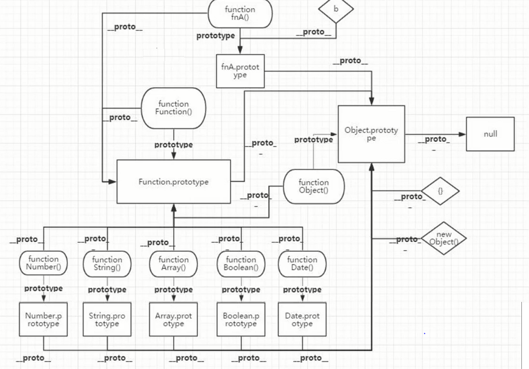

# TS 基础、技巧性技能

## 定义

融合了面向对象后端的思想的超级版的 JavaScript 语言

## 环境搭建

```powershell
npm init -y 

yarn  add typescript -D

tsc --init
```

## 优势：

**优势1：编译时静态类型检测**：函数或方法传参或变量赋值不匹配时，会出现编译错误提示 ，规避了开发期间的大量低级错误，省时，省力。

**优势2：能自动提示**：变量类型、变量属性，不用来回切换文件或不小心写错导致的编码隐患。

**优势3：** **引入了泛型**：让大中项目，前端框架底层源码具备了高可扩展性这个巨大的优势，同时也有类型安全检查的优势。

**优势4**： **强大的 d.ts 声明文件**：声明文件像一个书的目录一样，清晰直观展示了依赖库文件的接口，type类型，类，函数，变量等声明。

**优势5：轻松编译成 JS 文件**：即使 TS 文件有错误，绝大多数情况也能编译出 JS 文件。

**优势6：灵活性高：** 尽管 TS 是一门 强类型检查语言，但也提供了 any 类型 和 as any 断言，这提供了 TS的灵活度。

## tsconfig.json 常用 18 项配置选项详解 


```js
{
  "compilerOptions": {
    "target": "es2020", // 指定 TS 编译成 JS 后的js版本
    "module": "commonjs", // TS 编译成 JS 后采用的模块规范 commonjs amd cmd  es等         
    "lib": ["DOM","ES2020"], /*  指定 TS 编码期间可以使用的库文件版本 比如：ES5就不支持Set集合 */
    "outDir": "./dist", //     指定 TS 文件编译成 JS 后的输出目录                 /* Redirect output structure to the directory. */
    "rootDir": "./src", // 指定 TS 文件源码目录
    "strict": true, // 启用严格检查模式
    "strictNullChecks":false,// null 和 undefined即是值，也是类型, null 和 undefined 值 只能赋值给 any ,unknown和它们各自的类型
    "noImplicitAny": true, // 一般是指表达式或函数参数上有隐含的 any类型时报错
    "experimentalDecorators": true, /* 启用ES7装饰器实验开启选项 */
    "emitDecoratorMetadata": true, /* 启用装饰器元数据开启选项 */
    "declaration": true, // 指定 TS 文件编译后生成相应的.d.ts文件
    "removeComments": false, // TS 文件编译后删除所有的注释
    
    "baseUrl": "src", /* 工作根目录  解析非相对模块的基地址*/
    "paths": {
        "@/datatype/*": ["datatype/*"],
        "@/131/*": ["131/*"],
        "@/132/*": ["132/*"]
      },    
    // 有些依赖库底层 为了兼容CommonJs规范、AMD规范这二者的规范中相互兼容，
    // 使用了 export =，将二者规范统一。
    // "esModuleInterop":true表示允许依赖库中出现export = 这种兼容规范导出的格式，
    //  TS 可以用import from导入 
    "esModuleInterop": true,  
  },
  "include": [ // 需要编译的ts文件一个*表示文件匹配**表示忽略文件的深度问题
    "./src/**/*.ts" // 匹配src下所有的ts文件
, "src/datatype/typepsenumts"  ],
   "exclude": [
    "./src/**/test",
    "./src/**/premit", 
  ]
}
```

## 类型注解和类型推断

类型注解 ——ts 在编写代码期间就能确定变量的类型

```ts
// 类型注解
let price: number = 3
type StudentType = { name: string, age: number }
let stuObj: StudentType = { name: "wangwu", age: 23 }

// 类型推导
let count = 3;
let custObj = { name: "wangwu", age: 23 }
```

## any 和 unknown 的两个区别

相同点：都可以是其他类型的父类

不同点：any 可以作为其他类型的子类存在，unknown 只能作为其他类型的子类，unknown 不能点出其他任何的数据

```ts
let price: any = "abc"
let total: number = price

let stuObj: any = {username:"wangwu",age:23}


let stuName: unknown = {username:"wangwu",age:23}
// stuName.username

//let stuAge:number=stuName
```

## 函数和函数类型，rest 参数

```ts
function info(name: string, age: number) {
  console.log("name:", name, " age:", age);
  return 3
}

info("wangwu",23)
```

函数表达式：
```ts
let info = function (name: string, age: number) {
  console.log("name:", name, " age:", age);
  return 3
}

info("wangwu", 23)
```

函数类型：
```ts
let info: (name: string, age: number) => number =
  function (name, age) {
    console.log("name:", name, " age:", age);
    return 3
  }

info("wangwu", 23)

type TypInfoFun = (name: string, age: number) => number
let info: TypInfoFun =
  function (name, age) {
    console.log("name:", name, " age:", age);
    return 3
  }

info("wangwu", 23)
```

rest参数：
```ts
function info(name: string, age: number, ...rest: any) {
  console.log("name:", name, " age:", age, " rest:", rest);
  return rest
}

info("wangwu",23,"1111","beijing",23,)
```

## 函数类型升级

```ts
type TypStuobj = { username: string, age: number, phone: string }

function info(stuObj: TypStuobj) {
  console.log("name:", stuObj.username, " age:", stuObj.age);
  return 3
}

let stuObj: TypStuobj = { username: "wangwu", age: 23, phone: "111" }
info(stuObj)

// 函数解构
function subInfo({ username, phone }: TypStuobj) {
  console.log("name:", username, " phone:", phone);
  return 3
}

subInfo({ username: "lisi", age: 33, phone: "222" })
```

## string 和 String 的比较


```ts
String.length
String.fromCharCode

let str:string="abc"
```

string 是 String 的类型表现


## BigInt

1. number 的极限值运算


```js
// 获取最大的整数值
let max = Number.MAX_SAFE_INTEGER;

 let max1 = max + 5 
 let max2 = max + 15

 console.log(max1 === max2) // 结果相同——true 
```

2. 使用 BigInt 


```js
// 方法1：
// 第一步：
// 修改 tsconfig.json 选项——"lib": ["DOM","ES2020"] 

// 第二步：
let max = BigInt(Number.MAX_SAFE_INTEGER);

const max1 = max + BigInt(15)
const max2 = max + BigInt(5)

console.log("max1:", max1)// 9007199254740992n
console.log("max2:", max2)
console.log(max1 === max2) // false


// 方法2：
// 第一步：
// 修改 tsconfig.json 选项——"lib": ["DOM","ES2020"] + "target": "es2020"

// 第二步：
let max = BigInt(Number.MAX_SAFE_INTEGER);

const max1 = max + 15n
const max2 = max + 5n

console.log("max1:", max1)// 9007199254740992n
console.log("max2:", max2)
console.log(max1 === max2) // false

```

## 看似简单的取值为何总抛错？

```ts
// let obj = { username: "wangwu", age: 23 }
// let username = "username"
// obj[username]

// 解决：

// 1.
// let obj = { username: "wangwu", age: 23 }
// const username = "username"
// obj[username]

// 2.
let obj: object = { username: "wangwu", age: 23 }
const username = "username"
let result = (obj as any)[username]
```

## 什么场景 never 能被直接推导出来而不用定义？

使用 never 避免出现未来扩展新的类没有对应类型的实现, 目的就是写出类型绝对安全的代码。

```js
// dataFlowAnalysisWithNever 方法穷尽了 DataFlow 的所有可能类型。 
// 通过这个示例，我们可以得出一个结论：
// 使用 never 避免出现未来扩展新的类没有对应类型的实现，
// 目的就是写出类型绝对安全的代码。
type DataFlow = string | number
function dataFlowAnalysisWithNever(dataFlow: DataFlow) {
  if (typeof dataFlow === 'string') {
    console.log(dataFlow)
  } else if (typeof dataFlow === 'number') {

  } else {
    // dataFlow 在这里是 never 
    let nothings = dataFlow;//never
  }
}
dataFlowAnalysisWithNever("免税店")


export { }
```

## 枚举的好处——为什么要用枚举?

解决多次 if /switch 判断中值的语义化的问题 

1. 常量解决
2. 常量解决带来的局限性x

常量解决
```js
const Status = {
  MANAGER_ADUIT_FAIL: -1,
  NO_ADUIT: 0,
  MANAGER_ADUIT_SUCCESS: 1,
  FINAL_ADUIT_SUCCESS: 2
}
// 审核类
class MyAduit {

  getAduitStatus(status: number): void {

    if (status === Status.NO_ADUIT) {
      console.log("没有审核");
    } else if (status === Status.MANAGER_ADUIT_SUCCESS) {
      console.log("经理审核通过");
    } else if (status === Status.FINAL_ADUIT_SUCCESS) {
      console.log("财务审核通过");
    }
  }
}

const aduit = new MyAduit();
aduit.getAduitStatus(Status.MANAGER_ADUIT_FAIL);
export { }
```

常量解决带来的局限性：方法参数不能定义为具体类型，只能初级使用 number，string 基本类型替代，降低了代码的可读性和可维护性。

## 深入枚举 ，枚举分类，枚举底层，枚举好处

1. 枚举的定义
2. 枚举分类
3. 枚举取值方式
4. 枚举底层
5. 枚举应用

### 枚举的定义

定义:用来存放一组固定的常量的序列

### 枚举分类


```js
// 字符串枚举
enum EnumAuditStatus {
  MANAGER_ADUIT_FAIL = "项目经理审核失败"
  NO_ADUIT = "没有审核"
  MANAGER_ADUIT_SUCCESS = "项目经理审核成功"
  FINAL_ADUIT_SUCCESS = "财务审核成功"
}

//  字符串枚举
enum WeekEnd {
  Monday = "Monday",
  Tuesday = "Tuesday",
  Wensday = "Wensday",
  ThirsDay = "ThirsDay",
  Friday = "Friday",
  Sarturday = "Sarturday",
  Sunday = "Sunday"
}
```

```js
// 数字枚举
enum EnumAuditStatus {
  MANAGER_ADUIT_FAIL = -1,//第一个常量值设置为-1
  NO_ADUIT, // 第二个常量值自动递增1 就为0
  MANAGER_ADUIT_SUCCESS,// // // 第二个常量值自动递增2 就为1
  FINAL_ADUIT_SUCCESS // // // 第二个常量值自动递增3 就为2
}

// 数字枚举
enum Week {
  Monday = 1,
  Tuesday,
  Wensday,
  ThirsDay,
  Friday,
  Sarturday,
  Sunday
}
```

### 枚举取值方式


```js
export enum EnumAuditStatus {
  MANAGER_ADUIT_FAIL = -1,//第一个常量值设置为-1
  NO_ADUIT, // 第二个常量值自动递增1 就为0
  MANAGER_ADUIT_SUCCESS,// // // 第二个常量值自动递增2 就为1
  FINAL_ADUIT_SUCCESS // // // 第二个常量值自动递增3 就为2
}


// 取值方式1：枚举反向取值 根据枚举中常量值来取出常量名
console.log("EnumAuditStatus[0]", EnumAuditStatus[0]);
console.log("EnumAuditStatus[1]", EnumAuditStatus[1]);
// 取值方式2：枚举取值 根据枚举中常量名来取出常量值
console.log("EnumAuditStatus.FINAL_ADUIT_SUCCESS",
  EnumAuditStatus.FINAL_ADUIT_SUCCESS);	
```

### 枚举底层

**数字类型枚举底层**

双重映射

```js
var Week;
(function (Week) {
    Week[Week["Monday"] = 1] = "Monday";
    Week[Week["Tuesday"] = 2] = "Tuesday";
    Week[Week["Wensday"] = 3] = "Wensday";
    Week[Week["ThirsDay"] = 4] = "ThirsDay";
    Week[Week["Friday"] = 5] = "Friday";
    Week[Week["Sarturday"] = 6] = "Sarturday";
    Week[Week["Sunday"] = 7] = "Sunday";
})(Week || (Week = {}));
```

**字符串枚举底层**

```js
var WeekEnd;
(function (WeekEnd) {
    WeekEnd["Monday"] = "Monday";
    WeekEnd["Tuesday"] = "Tuesday";
    WeekEnd["Wensday"] = "Wensday";
    WeekEnd["ThirsDay"] = "ThirsDay";
    WeekEnd["Friday"] = "Friday";
    WeekEnd["Sarturday"] = "Sarturday";
    WeekEnd["Sunday"] = "Sunday";
})(WeekEnd || (WeekEnd = {}));
```

### 枚举好处

枚举带来的好处:

1. 有默认值和可以自增值,节省编码时间

2. 语义更清晰,可读性增强,

因为枚举是一种值类型的数据类型,方法参数可以明确参数类型为枚举类型


### 枚举应用


```js
export enum EnumAuditStatus {
  MANAGER_ADUIT_FAIL = -1,//第一个常量值设置为-1
  NO_ADUIT, // 第二个常量值自动递增1 就为0
  MANAGER_ADUIT_SUCCESS,// // // 第二个常量值自动递增2 就为1
  FINAL_ADUIT_SUCCESS // // // 第二个常量值自动递增3 就为2
}


interface Expense {
  id: number,
  events: string,
  time: Date,
  enumAuditStatus: EnumAuditStatus
}

class ExpenseService {
  addExpense(expense: Expense) { }
}
let expenseService = new ExpenseService();

// 审核类
class MyAduit {
  getAduitStatus(status: EnumAuditStatus): void {
    let mystatus: EnumAuditStatus = 10;//定义枚举类型的变量
    let mystatus2: EnumAuditStatus = mystatus;
    mystatus2 = mystatus2 + 1;
    console.log("mystatus:", mystatus);//10
    console.log("mystatus2", mystatus2);//11

    if (status === EnumAuditStatus.NO_ADUIT) {//NO_ADUIT=0
      console.log("没有审核");
    } else if (status === EnumAuditStatus.MANAGER_ADUIT_SUCCESS) {
      console.log("经理审核通过");
      let expense: Expense = {
        id: 1,
        events: "飞机票报销",
        time: new Date(),
        enumAuditStatus: status
      }
      expenseService.addExpense(expense)
    } else if (status === EnumAuditStatus.FINAL_ADUIT_SUCCESS) {
      console.log("财务审核通过");
    } else {
      console.log("审核失败");
    }
  }
}

const aduit = new MyAduit();
aduit.getAduitStatus(EnumAuditStatus.FINAL_ADUIT_SUCCESS);
export { }
```

## 元组

1. 为什么用元组(tuple)

2. 符合下面条件的数组就是一个元组

- 定义时的元素的类型确定，但各个元素的类型不必相同。
- 为元素赋值时，该值必须是当前位置的类型

```ts

let salary: [string, number, number, string] = ["王五", 8000, 10000, "ok"]

// 取值
console.log(salary[3])
```

## 接口 ( interface ）定义，实现，应用场景

**定义** 

是为一系列同类对象或同类别的类提供属性定义和方法声明但没有任何赋值和实现的数据类型。

**应用场景**

- 提供方法的对象类型的参数时使用
- 为多个同类别的类提供统一的方法和属性声明

```ts
interface Product {
  id: number;
  name: string;
  price: number;
  count: number
}

function calToal(product: Product) {
  console.log("product总价:", product.price * product.count)
}

calToal({ id: 100, name: "电脑", price: 5000, count: 10 })
```

## 接口可选属性，可索引类型，函数类型

```ts

interface Product {
  id: number;
  name: string;
  price: number;
  count: number;
  //mark?: string; //  可选属性
  [key: string]: any; // 可索引类型
  transfer: () => void //函数类型
}

function calToal(product: Product) {
  console.log("product总价:", product.price * product.count)
  product.transfer();
}

calToal({
  id: 100, name: "电脑", price: 5000, count: 10,
  mark: "注意轻纺", place: "", quatity: "二手",
  transfer() {
    console.log(this.name, "运输");
  }
})

interface Getter {
  [key: string]: (state: any) => void
}

let getter: Getter = {
  getProductInfo(state: string) {

  },
  getOneProduct(state: string) {

  }
}
```

## 接口继承实现

**接口继承的使用场景：**

新的接口只是在原来接口继承之上增加了一些属性或方法，这时就用接口继承

```js
// 例子1：
// 开始定义了一个接口
interface  Point{
    x:number;
    y:number;
}

// 需求发生了变化，但是是在原来 Point 接口的基础之上增加了一个新的 z:number 属性。
interface  Point3d extends Point{
    z:number;
}


// 例子2：Vue3源码中 稍复杂一点的接口继承
interface Error {
  name: string;
  message: string
}

interface CompilerError extends Error {
  code: number
}

const enum ErrorCodes {
  // parse errors
  ABRUPT_CLOSING_OF_EMPTY_COMMENT,
  CDATA_IN_HTML_CONTENT,
  DUPLICATE_ATTRIBUTE,
  END_TAG_WITH_ATTRIBUTES,
  END_TAG_WITH_TRAILING_SOLIDUS,
  EOF_BEFORE_TAG_NAME,
  EOF_IN_CDATA,
  EOF_IN_COMMENT,
  EOF_IN_SCRIPT_HTML_COMMENT_LIKE_TEXT,
  EOF_IN_TAG,
  INCORRECTLY_CLOSED_COMMENT
   ......
}
 
 interface CoreCompilerError extends CompilerError {
  code: ErrorCodes
}

//  其他应用比较少的场景:
//  1 接口也可以继承多个接口  2 接口可以继承类  3 类可以继承一个或多个接口
```

## 联合类型

```ts
// 指多个类型的合并类型
// 1. 基本数据类型的联合类型

function add(previous: string | number, current: string | number) {
  
}


// 2. 引用类型的联合类型
interface Car {
  brand: string;//  品牌
  No: number;// 车牌号
  price: number;
  placeOrigin: string;//产地
  load(): void
}

interface Plane {
  category: string;// 飞机类别
  price: number;// 价格
  placeOrigin: string;// 产地
  airline: string;// 所属航空公司
  load(): void
}

function carry(vechile: Car | Plane) {// 运载
  vechile.load();
}
```

##  使用 type  定义类型

type 和接口类似，都用来定义类型，但 type 和 interface 区别如下：

 **区别1： 定义类型范围不同**

interface 只能定义对象类型或接口当名字的函数类型。

type 可以定义任何类型，包括基础类型、联合类型 ，交叉类型，元组。

```js
// type 定义基础类型
type num=number 

//  type 定义联合类型例子1：
type baseType=string |number | symbol

//  type 定义联合类型例子2：
interface Car { brandNo: string}
interface Plane { No: string; brandNo: string}
type TypVechile = Car| Plane 

//  元组
interface Car { brandNo: string}
interface Plane { No: string; brandNo: string}
type TypVechile = [Car, Plane]
```

**区别2 ：接口可以extends 一个或者多个 接口或类， 也可以继承type，但type 类型没有继承功能**

**但一般 接口继承 类 和 type 的应用场景很少见，同学们记住有这样的语法即可。**

**区别3：用 type 交叉类型 & 可让类型中的成员合并成一个新的 type 类型，但接口不能交叉合并**

```js

type Group = { groupName: string, memberNum: number }
type GroupInfoLog = { info: string, happen: string }
type GroupMemeber = Group & GroupInfoLog// type 交叉类型合并

let data: GroupMemeber = {
  groupName: "001", memberNum: 10,
  info: "集体爬山", happen: "中途有组员差点滑落,有惊无险",
}

export { }
```

**区别4：接口可以合并声明**

定义两个相同名称的接口会合并声明，定义两个同名的type会出现编译错误。

```js
interface Error {
  name: string;
}

interface Error {
  message: string;
  stack?: string;
}
// 接口合并
let error: Error = {
  message: "空指针",
  name: "NullPointException"
}
```


```ts
interface ActionContext {
  (state: any, commit: any): void
}

let actionContext:ActionContext=(state:any,commit:any):void=>{
    console.log("state:",state);
}
actionContext("abc","df")
```

## 一个联合类型技巧性使用的场景

把值当类型

```ts
type IncreaseBoolean = Boolean | 1 | 0

function mounted(isStartUp: IncreaseBoolean) {
  if (isStartUp) {
    console.log("yes");
  } else {
    console.log("no");
  }
}

mounted(1)
```

## 为什么要用声明文件？

如果文件使用 TS 编写，在编译时可以自动生成声明文件，并在发布的时候将 .d.ts  文件一起发布，我们无需编写声明文件。

当我们在 TS 文件中引入使用第三方库的类型或使用 集成库 时，比如：@types/jquery  库，ES6 库的 Map 类型 ，这些库用 JS 开发，不能获取 TS 一样的 类型提示，需要一个声明文件来帮助库的使用者来获取库的类型提示。

**注意：声明文件中只对类型定义，不能进行 赋值 和 实现。**

##  声明文件实现

1. js 文件 如何感知声明文件的作用
2. 学会定义和使用声明文件

```js
// 关键字 declare 表示声明的意思,我们可以用它来做出各种声明:

declare let/const  // 声明全局变量
declare function   // 声明全局方法
declare class      // 声明全局类
declare enum       // 声明全局枚举类型 
declare namespace  // 声明（含有子属性的）全局对象
interface/type     // 声明全局类型
```

```ts
declare namespace JQuery {
  type cssSelector = {
    css: (key: string, value: string) => cssSelector
  }
  export function $(ready: () => void): void
  export function $(selector: any): cssSelector
  export namespace $ {
    function ajax(url: string, settings?: any): void
    function get(url: string, settings?: any): void
    function post(url: string, settings?: any): void
  }
}
```

## 正确理解 declare

```ts
declare function my(one: number, two: number): void
```

```json
//"skipLibCheck": true,                           /* Skip type checking of declaration files. */
```

类型可以不加 declare；function、class 必须加 declare

##  命名空间在声明文件中的使用

```ts
declare module "JQueryModule" {
  type cssSelector = {
    css: (key: string, value: string) => cssSelector
  }
  function $(ready: () => void): void
  function $(selector: any): cssSelector
  namespace $ {
    function ajax(url: string, settings?: any): void
    function get(url: string, settings?: any): void
    function post(url: string, settings?: any): void
  }
  //export default $
  export =$
}
```

## 模块声明

```ts
declare module "JQueryModule" {
  type cssSelector = {
    css: (key: string, value: string) => cssSelector
  }
  function $(ready: () => void): void
  function $(selector: any): cssSelector
  namespace $ {
    function ajax(url: string, settings?: any): void
    function get(url: string, settings?: any): void
    function post(url: string, settings?: any): void
  }
  //export default $
  export =$
}
```

## 如何在 TS 中引入 js 文件

打开以下配置即可：

```ts
    "allowJs": true, /* Allow javascript files to be compiled. */
```

## 原型和原型继承

原型和原型继承几乎是每场面试必考的 JS 基础核心技能之一，也是任何上层框架 和 TS 技术 的根基技术之一


