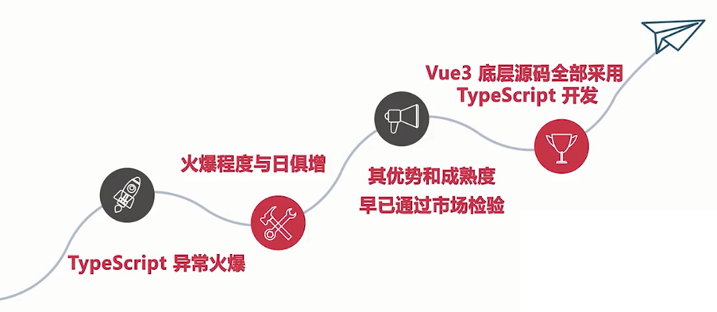

# 简介



几乎所有企业的大中型前端项目中都融合了 TypeScript

- Vue3 + Vuex 的项目
- React Hooks 的项目
- 后端 Nodejs 融合 TS 技术
- 各种 d.ts 文件全为 TS 技术

## TS 的重要性

- 面试
- 项目

痛点：已经掌握了大量的 TS 基本语法，但不能应付公司中大中项目的要求

未能达到项目要求原因：

1. 不能多维度掌握 TS 知识
   - 从 Vue3 源码
   - TS 底层复杂 JS 源码
   - 真实应用场景
   - 实战
   - 手写源码
2. 对 TS 的广度和深度掌握远不够，理解不彻底，一知半解
   - 类
   - 泛型
   - 装饰器
   - 理解深度
   - 知识点：
     - 原型、类、引用属性
     - 单件设计模式+各种扩展
     - 各种重载
     - 基础+手写优化 TS 继承源码
     - 各种泛型技能
     - 装饰器
     - 手写 Promise 源码
     - 手写 Vuex 源码
3. 缺少实战能力，没有足够的实战和原理同步同行，很难锤炼出高水准的 TS
   - 深入 + 手写 TS 底层源码
   - 手写 Promise 源码
   - 手写 Vuex 源码


## TS 本质

是一门融合了部分 Java 后端思想的前端 JS 语言

必须吃透：

- TS 蕴含的 Java 思想
- TS 底层复杂的 JS 技能
- TS 自带语法
- 无比重要和有深度的庞杂的泛型技能

## 【环境搭建】搭建 TS 自动更新+TS 自动运行+Parcel 自动打包环境

**步骤**：

（1）初始化 npm init --yes 出现 package.json

（2） 安装 typescript

- 全局安装 cnpm i typescript -g     或
- 本地安装： cnpm i typescript -D   或
- yarn 安装 yarn global add typescript

【cnpm i typescript -D 是 cnpm install typescript --save-dev的缩写】

(3）生成tsconfig.json文件： `tsc --init`

(4）修改 tsconfig.json 中的配置

- "outDir:  "./dist", --outDir 是 ts 编译后生成 js 文件保存的目录
- "rootDir": "./src", --rootDir 是自己编写的 ts 源文件所在的目录
- 注意: dist src package.json 必须是在一个目录下

(5) 编译 src 目录以及子目录下的 ts 文件

​- `tsc` 【在src当前目录下：输入tsc   注意直接写tsc命令即可】
- 【会把src目录以及子目录下的ts文件全部编译成js文件，并全部输出到dist目录中】

(6）安装 ts-node

​ts-node 让 node 能直接运行 ts 代码，无需使用 tsc 将 ts 代码编译成 js 代码。【ts-node 则包装了 node，它可以直接的运行 ts 代码】

​- 全局安装     cnpm i ts-node -g     或
- 本地安装： cnpm i ts-node -D   或
- yarn 安装：yarn global add ts-node

(6）安装 nodemon 工具 【自动检测工具】

nodemon 作用：【nodemon 可以自动检测到目录中的文件更改时通过重新启动应用程序来调试基于 node.js 的应用程序】

- 全局安装  cnpm install -g nodemon 或
​- 本地安装  cnpm i nodemon -D 或
- yarn安装  yarn add nodemon -D

(7） 在package.json中配置自动检测，自动重启应用程序

```js
"scripts": {
    "dev": "nodemon --watch src/ -e ts --exec ts-node ./src/app.ts"
}
```

- nodemon --watch src/  表示检测目录是package.json同级目录src
- `-e ts`   表示 nodemon 命令准备将要监听的是ts后缀的文件
- `--exec ts-node ./src/project/app.ts` 表示检测到src目录下有任何变化 都要重新执行app.ts文件

2. Parcel打包支持浏览器运行TS文件

​（1）安装 Parcel 打包工具：npm install parcel-bundler --save-dev

​（2）在 package.json 中给 npm 添加启动项，支持启动 parcel 工具包

```js
"scripts": {
   "start": "parcel ./index.html"
},
```

​（3)  启动 parcel 工具包

​cnpm run start  【cnpm start】或  npm  run start  【npm start】或 yarn run start 【yarn start】
