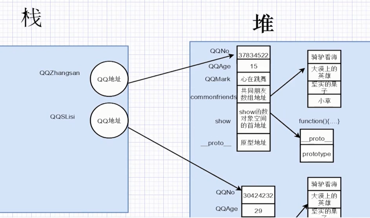
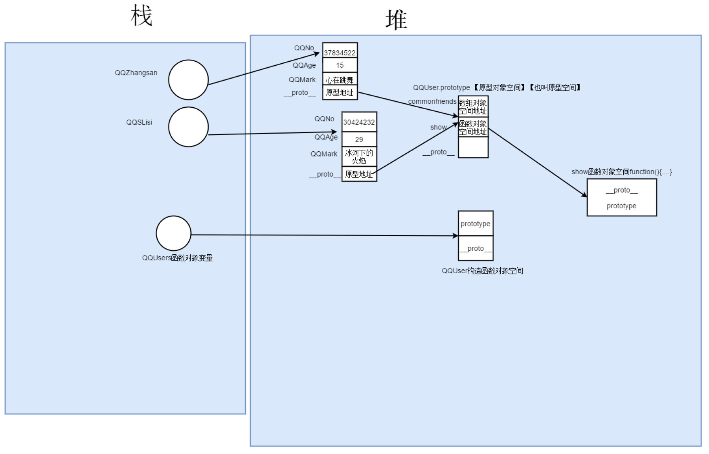
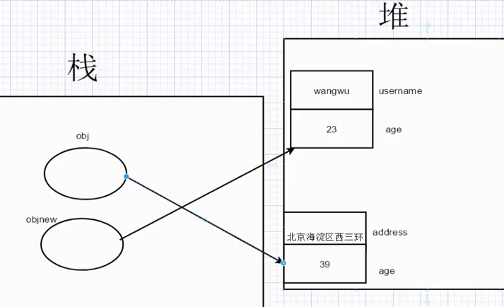
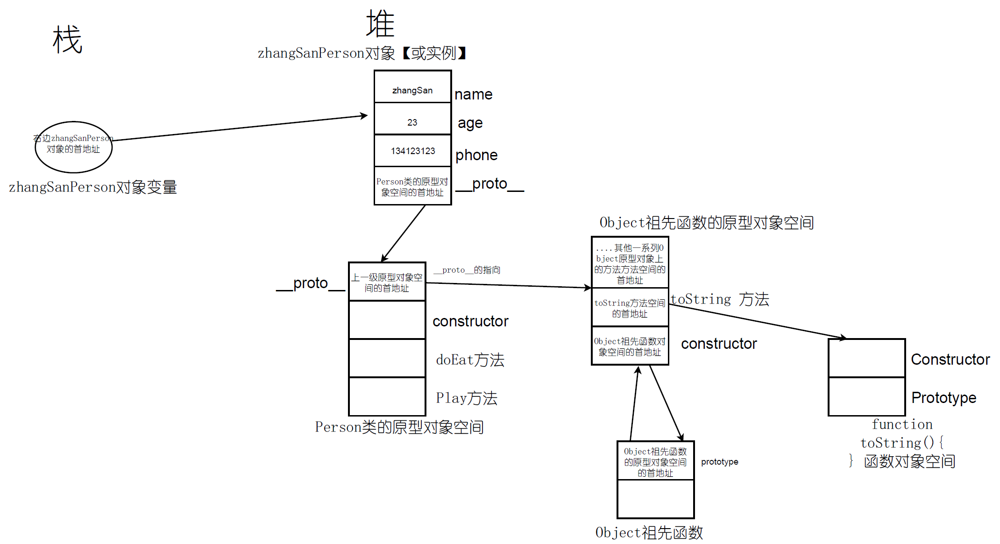
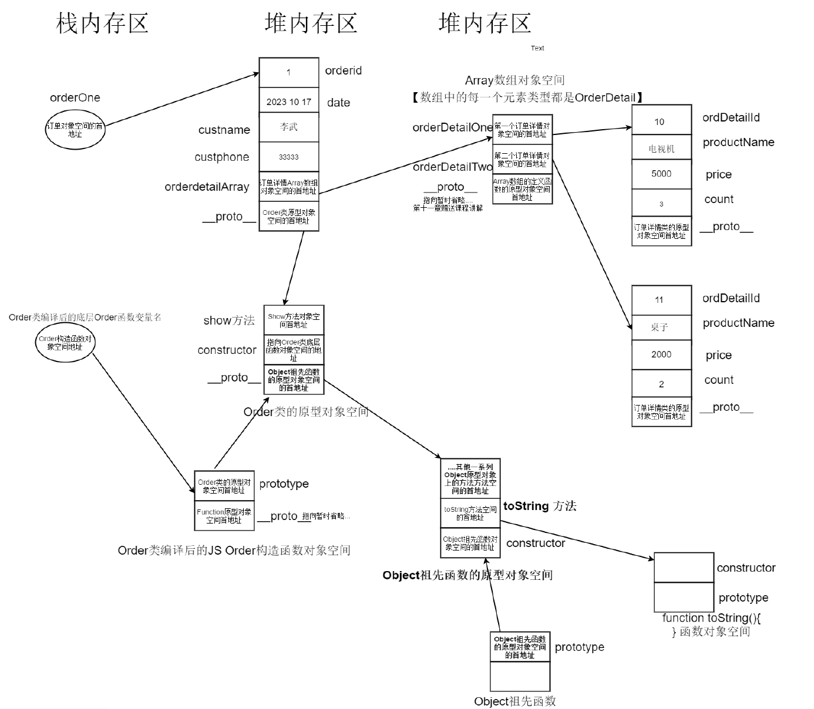
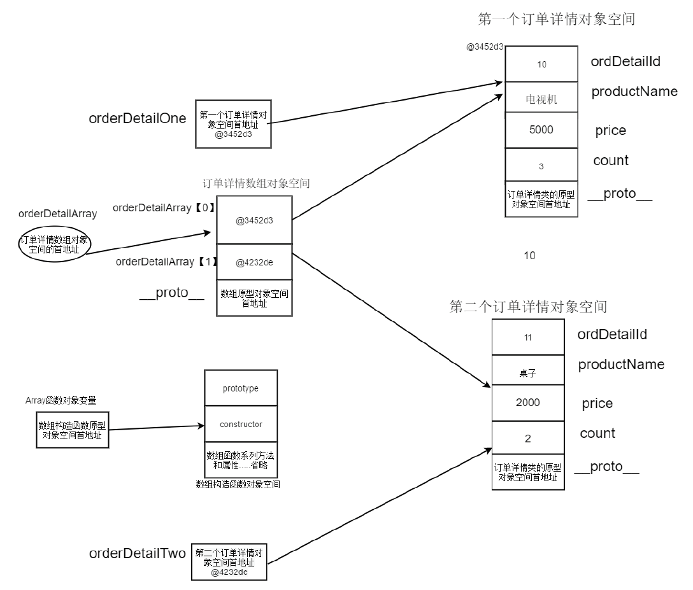

# 全面深度掌握 TS 类

## 【TS 类准备】TS 类底层根基，不一样的方式理解 JS 原型

1.为什么要用原型 【好处】

​原型上所有的方法和属性都可以被构造函数【实际开发原型主要共享方法和所有实例公用引用属性】的实例共享，那为什么要共享呢？

先来看一个案例 【先不用管什么是原型】

```js
function QQUsers (QQNo_, QQAge_, QQMark_) {
this.QQNo = QQNo_;//QQ号
this.QQAge = QQAge_;//Q龄
this.QQMark = QQMark_;//QQ标签
//引用对象类型=引用类型=对象类型=引用数据类型
// 数组也是一种引用数据类型
this.commonfriends = ['骑驴看海', '大漠上的英雄', '坚实的果子', '小草']//共同好友
// 方法也是一种引用数据类型
this.show = function () {
    console.log(`QQ号:${this.QQNo},QQ龄:${this.QQAge},QQ标注:${this.QQMark}`)
    console.log(`共同的好友是:${this.commonfriends}`);
}
}
// 对象也叫实例(instance)
// QQZhangSan叫做对象变量 对象是等号右边通过new出来的一个实例 而且是运行期间才在堆中开辟对象的内存空间
let QQZhangSan = new QQUsers("37834522", 15, "王阳明传人")
let QQLisi = new QQUsers("30424232", 10, "袁隆平的徒弟")
//let QQLiuwu = new QQUsers("刘武", 12, "飞起来的鸭子")

QQZhangSan.show();
QQLisi.show();
//QQLiuwu.show();
```



    **栈**：运行时执行放大会入栈，方法执行结束后方会出栈。

2.没有用原型会有什么问题?

总结问题:所有 QQUser 对象【也叫 QQUser 实例】都有相同的好友属性，好友属性用 commonfriends 英文表示，所有 QQUser 对象都有相同的 show 方法。但我们发现每一个 QQUser对象 【也叫 QQUser 实例】都单独分配一个 commonfriends 属性空间和 show 方法空间，浪费了大量内存空间

答案：使用原型解决所有实例上的方法，还有所有实例上的共同属性都可以放在原型上去定义。

## 【TS 类准备】TS 类底层根基，深入 JS 原型，深度透彻掌握原型

3.认识函数+原型定义

​    （1）函数也是一个对象，当真正开始执行函数，执行环境【开发时为浏览器或控制台】会为函数分配一个函数对象变量空间和函数对象空间，函数对象变量用函数名表示，存在栈空间中， 函数对象空间是在堆中开辟的一个内存空间，这个空间中有一个默认的 prototype 属性，这个 prototype 属性就是一个原型对象属性【也叫对象变量】

  （2） 函数和构造函数的区别

​     当通过 new 函数()时，此刻这个函数就是构造函数【 日后会演变成TS 类的构造器】

  （3）定义：原型【 prototype ] 是定义函数由 JS 自动分配给函数的一个可以被所有构造函数实例对象变量共享的对象变量【也叫对象属性】

4. 如何访问原型对象空间上的属性和方法

（1）构造函数所有实例对象都可以访问型对象空间上的属性和方法 【每一个实例都有默认的 `__proto__` 属性，这个 `__proto__` 属性指向原型对象空间】

 （2）关于`__proto____`：new 在创建新对象的时候，会赋予新对象一个属性指向构造函数的 `prototype` 对象空间，这个属性就是  `__proto__`

   (3） 可以直接通过构造函数.prototype 对象属性来访问原型对象空间上的属性和方法



```js
function QQUsers (QQNo_, QQAge_, QQMark_) {
  this.QQNo = QQNo_;//QQ号
  this.QQAge = QQAge_;//Q龄
  //this.QQMark = QQMark_;//QQ标签
}

QQUsers.prototype.commonfriends = ['骑驴看海', '大漠上的英雄', '坚实的果子', '小草']
QQUsers.prototype.show = function () {
  console.log(`QQ号:${this.QQNo},QQ龄:${this.QQAge},QQ标注:${this.QQMark}`)
  console.log(`共同的好友是:${this.commonfriends}`);
}
let QQZhangSan = new QQUsers("37834522", 15, "王阳明传人")
let QQLisi = new QQUsers("30424232", 10, "袁隆平的徒弟")
console.log("QQLisi:", QQLisi)
console.log("QQLisi.commonfriends:", QQLisi.commonfriends)
//console.log("QQZhangSan.QQMark:", QQZhangSan.QQMark)
console.log("QQZhangSan.commonfriends:", QQZhangSan.commonfriends)

//let obj = {username:"wangwu"}
//obj.age=23
//console.log(obj);
//let obj2=new Object();
console.log("QQUsers.prototype:", QQUsers.prototype);

// QQUsers.prototype={
//   constructor: ƒ QQUsers(QQNo_, QQAge_, QQMark_)
//   __proto__: Object
//   }
```

```js
function QQUsers (QQNo_, QQAge_, QQMark_) {
  this.QQNo = QQNo_;//QQ号
  this.QQAge = QQAge_;//Q龄
  this.QQMark = QQMark_;//QQ标签
}
//方法栈--执行方法时的栈区

QQUsers.prototype.commonfriends = ['骑驴看海', '大漠上的英雄', '坚实的果子', '小草']
QQUsers.prototype.show = function () {
  console.log(`QQ号:${this.QQNo},QQ龄:${this.QQAge},QQ标注:${this.QQMark}`)
  console.log(`共同的好友是:${this.commonfriends}`);
}

let QQZhangSan = new QQUsers("37834522", 15, "王阳明传人")
let QQLisi = new QQUsers("30424232", 10, "袁隆平的徒弟")
//QQUsers.prototype.commonfriends.push("大树");
console.log(QQZhangSan.commonfriends);
console.log(QQLisi.commonfriends);

QQUsers.prototype = {
  commonfriends: ["abc", "bcd", '骑驴看海']
}

console.log("QQUsers.prototype:", QQUsers.prototype)
console.log("QQZhangSan.commonfriends:", QQZhangSan.commonfriends)
console.log("QQUsers.prototype.commonfriends:", QQUsers.prototype.commonfriends)
```

5.1 构造函数实例【也叫对象】如何访问原型对象空间上的属性和方法

​	 （1）构造函数实例访问一个属性和方法，首先从实例空间中查找【当执行环境执行 new 构造函数()时，构造函数中通过 this 定义的属性和方法会分配在这个空间中】，如果找到该属性和方法，就停止查找，表示找到了；如果没有找到，就继续在该实例的原型对象空间中去查找该属性和方法 【实例中默认的  `__proto__` 对象 属性指向原型对象空间】

​      （2）实例正是借助自身的 `__ proto __` 对象属性 来查找原型对象空间中的属性和方法，有点像儿子去和爸爸要他没有的东西一样。】

```js
let obj = { username: "wangwu", age: 23 }
let objnew = obj;

obj = { address: "北京海淀区西三环", age: 39 }
console.log("obj:", obj);
console.log("obj2:", objnew)


//obj.username = "lisi"
//obj.phone = "123"
// let objnew = new Object();
// objnew.username = "王五"
// objnew.age = 33
// console.log("objnew:", objnew);
//let obj={}
```



**增加或修改原型对象的属性或方法后， 所有的实例或叫对象立即可以访问的到 【但创建实例后再覆盖原型除外】**

- 高频面试题：创建实例后再覆盖原型，实例对象无法访问到,为什么？
- 思考题：`QQZhangSan.__proto__.show()` 和 `QQZhangSan.show()`  输出的结果完全一样吗？ 为什么呢

## 全栈思维全面掌握 TS 类

用全栈的眼光带你更深入理解 TypeScript 类

### **1. 学习 TypeScript 类的深远意义**

相对以前 JavaScript 不得不用 构造函数来充当”类“，TypeScript 类的出现可以说是一次技术革命。让开发出来的项目尤其是大中项目的可读性好，可扩展性好了不是一点半点。

TypeScrip 类的出现完全改变了前端领域项目代码编写模式，配合 TypeScript 静态语言，编译期间就能检查语法错误的优势【项目上线后隐藏语法错误的风险几乎为零，相比不用 TypeScript 开发项目，使用 TypeScript 后对前端项目尤其是大中项目的开发 或底层第三方插件，组件库的开发带来的优势已经超乎了想象】。

TypeScript 类让前端开发人员开发和组织项目或阅读各大前端框架源码的思维问题的方式变得更先进，更全面了许多。因为类是 OOP【面型对象编程】的技术基石，OOP 思想来自于生活，更利于开发人员思考技术问题。TypeScript 类已经成了每次前端面试的高频面试考点。

在前端各大流行框架开发的项目中，比如 Vue3 项目，Angular项目， 基于 Antd UI 库的项目 还是后端 Nodejs 框架，比如：Nestjs，亦或是 Vue3 底层源码，都可以频频见到类的身影。

尽管 TypeScript 类照搬了 Java 后端语言的思想，但 TypeScript 类的底层依然是基于 JavaScript 的，这一点对于前端工程师更深入理解 TypeScript 打开了一条理解之道，提升他们更深厚的 JavaScript 功底从而为面试加分和项目的运用都提供了间接的帮助。

### **2. TypeScript 哪些技能基于类？**

TypeScript 类是 OOP 的技术基石，包括类、属性封装、继承、多态、抽象、泛型。紧密关联的技术包括方法重写，方法重载，构造器，构造器重载，类型守卫，自定义守卫，静态方法、属性，关联引用属性，多种设计模式等。

### **3. 什么是类**

定义：类就是拥有相同属性和方法的一系列对象的集合，类是一个摸具，是从这该类包含的所有具体对象中抽象出来的一个概念，类定义了它所包含的全体对象的静态特征和动态特征。

类有静态特征和动态特征【以大家最熟悉的人类为例】
静态特征【软件界叫属性】姓名，年龄,地址,身份证号码,联系方式,家庭地址,微信号
动态特征【软件界叫方法】吃饭，走路

【再看桌子类】

静态特征【属性】高度，宽度，颜色，价格，品牌，材质

动态特征【方法】承载

【来看订单类】

静态特征 【属性】 订单号【订单id】，下单时间，下单顾客，订单详情，顾客微信，收件地址，负责客服

动态特征  【方法】 下单，修改订单，增加订单，删除订单，查询订单，退单 【这一些方法真正开发会归为OrderService 类】 但从广义来说都同属于订单系列类的方法。

### **4. 理解子类**

（1）什么是子类？

有两个类，比如 A 类和 B 类，如果满足 A 类  is a kind of  B类，那么 A 类就是 B 类的子类

比如：A 类是顾客类，B 类是人类，因为顾客类 a kind of 人类成立【顾客类是人类的一种】，所以顾客类是人类的子类。

（2） 子类如何继承父类的属性和方法？

以顾客类为例子：顾客类继承了父类【人类】的非私有的属性和方法，也具备子类独有的属性和方法 。

顾客类继承父类【人类】的全部非私有的属性和方法外，还有哪些独有的属性和方法呢？

- 顾客类独有属性：顾客等级，顾客编号
- 顾客类独有方法：购买

### **5. 什么是对象【对象也叫实例(instance)，对象变量也叫实例变量】**

(1)  什么是对象【实例】？

 就是一个拥有具体属性值和方法的实体，是类的一个具体表现，一个类可以创建1个或者多个对象

(2)  如何通过类来创建对象 【实例】？

```ts
let 对象变量名= new 类名（）
const 对象变量名= new 类名（）
```

(3)  如何根据People类来创D建叫张三对象【实例】的人？【举例】

```ts
 let  kateCust=new Customer()
// kateCust 是对象变量名 ，new Customer()  表示 new 出来的是一个Customer对象，而且是运行期间才在堆中分配 Customer 对象的内存空间 【 new  就是分配内存空间的意思】
```

（4）类的对象变量丶对象内存图展示

（5）类的对象变量，对象的关系

类的对象变量存在栈中，对象变量存储着对象的首地址，对象变量通过这个地址找到它的对象

```ts
//  姓名，年龄,地址,身份证号码,联系方式,家庭地址,微信号
class Person {//属性

  //public  name:string |undefined//typescript4.0之前属性如果没有赋值的解决方法 增加一个undefined数据类型
  // 类上定义的属性一定是描绘这个类本身特征的变量，不能把一些无关的变量定义成类属性
  public name: string = "noname"//赋初值为noname
  public age: number = 0
  public phone: string = "11111"
  // 对象的变量=实例的变量=类的【非静态的】属性=简称属性
  //  实例属性或者对象属性

  constructor(name_: string, age_: number, phone_: string) {//无参构造器
    this.name = name_;
    this.age = age_;
    this.phone = phone_;
  }

  //function  错误,类中定义方法不能用function
  // public play(): number {
  //   //return "df"//不能将类型“string”分配给类型“number”
  //  // return 3

  // }

  public doEat(who: string, address: string): void {//方法默认的返回值为void
    console.log(`${this.name}和${who}吃饭,在${address}吃饭`);
  }

  public doStep() {

  }
}

//let zhangSanPerson = new Person();
//给对象赋值的两种方式
// 方法1：通过类中属性或者方法来赋值
// zhangSanPerson.name = "zhangSan"
// zhangSanPerson.age = 23
// zhangSanPerson.phone = "134123123"

// zhangSanPerson.doEat("李四", "王府井")

// 方法2： 通过构造函数 【构造器】来赋值
// 创建对象一共做了三件事
// 第一件事: 在堆中为类的某个对象【实例】分配一个空间
// 第二件事：调用对应的构造函数【构造器】并且把构造器中的各个参数值赋值给对象属性
//   new Person()自动匹配无参数的构造器
// 第三件事：把对象赋值给对象变量 【把实例赋值给实例变量】
let zhangSanPerson = new Person("zhangSan", 23, "134123123");
zhangSanPerson.doEat("李四", "王府井")

console.log(zhangSanPerson)
//let obj={username:"wangwu",playgame(){}}
```



## 【TS 类源码】详解 TS 类底层源码【原生 ES5 语法】

```js
"use strict";
//  姓名，年龄,地址,身份证号码,联系方式,家庭地址,微信号
var Person = /** @class */ (function () {
  // 对象的变量=实例的变量=类的【非静态的】属性=简称属性
  //  实例属性或者对象属性
  function Person (name_, age_, phone_) {
    //public  name:string |undefined//typescript4.0之前属性如果没有赋值的解决方法 增加一个undefined数据类型
    // 类上定义的属性一定是描绘这个类本身特征的变量，不能把一些无关的变量定义成类属性
    this.name = "noname"; //赋初值为noname
    this.age = 0;
    this.phone = "11111";
    this.name = name_;
    this.age = age_;
    this.phone = phone_;
  }
  //function  错误,类中定义方法不能用function
  // public play(): number {
  //   //return "df"//不能将类型“string”分配给类型“number”
  //  // return 3
  // }
  Person.prototype.doEat = function (who, address) {
    console.log(this.name + "\u548C" + who + "\u5403\u996D,\u5728" + address + "\u5403\u996D");
  };
  Person.prototype.doStep = function () {
  };
  return Person;
}());
```

立即执行函数，避免了变量名被污染

## 【TS 类晋级】深度掌握 TypeScript 引用属性和它的真实应用场景

1 如何理解类的引用属性【引用类型属性

（1）什么是引用属性：如果类中的属性的类型是引用类型，那么这个属性就是引用属性

引用属性的数据类型一般有数组 ，函数，类，对象类型[{.... }格式]，对象数组类型，集合类【Set，Map,自定义集合类】

（2） 引用属性的经典应用场景

举几个经典的案例：

- **真实应用场景1**： 底层经典案例：如果我们使用 TypeScript 来开发一个 ES6 的 Set 集合类就是对数组的二次包装，在这个 Set 集合类中就需要包含一个数组的引用属性供Set类的各个方法来使用。

- **真实应用场景2**：底层经典案例：Promise 是前端很重要的技术，Promise 底层类中就采用了函数类型的引用属性。

- **真实应用场景3**：二次封装应用场景：Set 集合虽好，但不能使用 get(index) 直接取值，这也造成了取值不方便，如果我们自己动手封装一个包含了 add、get、remove、delete、query 的集合类【ArrayList】，这时也需要借助数组引用属性 。

- **真实应用场景4**：各种 Nodejs 后端项目构建的应用场景：我们以同学们相对熟悉的订单详情类和订单类为例，下面我们说明并定义电商平台必用的两个类——订单详情类【OrderDetail】和订单类【订单类】转至1.2 。

- **真实应用场景5**：跨前端领域的 Java 后端大量使用了引用属性。【第5点可以先知道下即可】。

2  类的引用属性真实应用场景：订单详情类和订单类

【一个订单对象有多个订单详情对象】

（1）再说明订单类产生过程

每个顾客每下一次订单，都会生成一个或者多个订单详情 【一件商品生成一个订单详情】但每次只能生成一个订单，也就是一个订单中包含了一个或者多个订单详情，我们可以定义一个订单类【Order】

订单类包括了订单 Id，订单日期，顾客地址，顾客名，顾客微信，顾客手机号，客服

（2）先说明订单详情类产生过程

顾客在淘宝上下一次订单购买了三件商品，用三条记录来表示：

- 第一个订单详情记录： 1   "笔记本" 6898  8
- 第二个订单详情记录：  2    "电脑桌" 7878  9
- 第三个订单详情记录：  3    "手机"   3789  2
- 每一个订单详情都可以用一个对象来表示 【订单详情对象】

创建一个订单详情类【OrderDetail】 然后 new 出 3 个订单详情类的实例 【当然也可以 new 出 n 个】

OrderDetail.ts
```ts
// 订单详情类
export default class OrderDetail {

  public orderDetailId: number = 0;
  public productname: string = "noproduct"//订单详情中的商品名[顾客购买的商品]
  public price: number = 0;//购买的商品的价格
  public count: number = 0;//购买数量

  constructor(orderDetailId_: number, productname_: string,
    price_: number, count_: number) {

    this.orderDetailId = orderDetailId_;
    this.productname = productname_;
    this.price = price_;
    this.count = count_
    //return this
  }
}
let orderDetailOne = new OrderDetail(10, "电视机", 5000, 3);
```

Order.ts
```ts
import OrderDetail from './OrderDetail'
class Order {
  //订单 Id，订单日期，顾客地址，顾客名，顾客微信，顾客手机号，客服
  public orderId: number = 0;
  public date: Date = new Date();
  public custname: string = "nocustname"
  public phone: string = "111"
  //public orderDetail:OrderDetail[]=[]
  //public orderDetail:Set=[]
  //原始值类型=基本数据类型
  // 这是一个引用属性【数组类型的引用属性】
  public orderDetailArray: Array<OrderDetail> = []//定义了一个Array数组,Array数组当中的每一个元素都是OrderDetail类型的元素
  //public orderDetailArray: Array<OrderDetail> = new Array()//定义了一个Array数组,Array数组当中的每一个元素都是OrderDetail类型的元素
  constructor(orderId_: number, date_: Date, custname_: string,
    phone_: string, orderDetailArray_: Array<OrderDetail>) {
    this.orderId = orderId_;
    this.date = date_;
    this.custname = custname_;
    this.phone = phone_
    this.orderDetailArray = orderDetailArray_
  }

  public static peisong(){
    let time="2024-01-02"
  }
}

let orderDetailOne = new OrderDetail(10, "电视机", 5000, 3);
let orderDetailTwo = new OrderDetail(11, "桌子", 2000, 2);
//let orderDetailThree=new OrderDetail(12,"桌子",2000,2);

// 给数组赋值方式1：直接定义数组时赋值
let orderDetailArray: Array<OrderDetail> = [orderDetailOne, orderDetailTwo]
// 给数组赋值方式2：定义完成以后再单独赋值
//let orderDetailArray: Array<OrderDetail> = []=new 了数组
//orderDetailArray[0]=orderDetailOne
//orderDetailArray[1]=orderDetailTwo

//定义数组并赋值的第三种方式
//let orderDetailArray: Array<OrderDetail> = [] 等价于let orderDetailArray: Array<OrderDetail> =new Array()
//let orderDetailArray: Array<OrderDetail> =
//new Array(orderDetailOne, orderDetailTwo)

var orderDate = new Date(2023, 10, 17, 5, 20, 0);

// let order = new Order(1, orderDate, "李武", "33333", orderDetailArray);
//写法2:
let order = new Order(1, orderDate, "李武", "33333",
  [orderDetailOne, orderDetailTwo]);

console.log(order);
```





## 【TS 类构造器】TS 类构造器赋值+TS4 新赋值方式

体会优化的属性定义和赋值带来的优势

1. 构造器简洁赋值
```ts
class Order {
  // public orderId: number;
  // public date: Date
  // public custname: string
  // public phone: string
  // public orderDetailArray: Array<OrderDetail> = []//定义了一个Array数组,Array数组当中的每一个元素都是OrderDetail类型的元素
  // 给构造器的参数如果加上public,这个参数就变成了一个属性,
  //   这种简洁写法是两步综合体： 第一步：定义了一个属性，
  //   第二步：等于默认构造函数会给这个属性赋值[隐式操作]
  constructor(public orderId: number, public date: Date,
    public custname: string,
    public phone: string, public orderDetailArray: Array<OrderDetail>) {
    return this;
    // this.orderId = orderId_;
    // this.date = date_;
    // this.custname = custname_;
    // this.phone = phone_
    // this.orderDetailArray = orderDetailArray_
  }
}
```

TypeScript4 的新特性

```ts
// 订单详情类
export default class OrderDetail {
  // TS4之前针对
  // 没有初始化的值，也没有在构造函数中明确给这个赋值的一种解决方案
  // 增加undefined类型就可以
  public orderDetailId: number | undefined;
  public productname: string
  // TS 之后加个 ！
  public price!: number
  public count!: number

  constructor(orderDetailId_: number, productname_: string,
    count_: number, price_: number) {

    this.orderDetailId = orderDetailId_;
    this.productname = productname_;
    // this.price = price_;
    this.count = count_
  }

  public getTotal(): number {
    return this.price * this.count
  }
}
let orderDetail = new OrderDetail(12, "cc", 30, 2);
console.log(orderDetail.getTotal());//NaN

console.log(typeof orderDetail.price)//undefined
```

## 扩展知识补充：TS 类 和 ES6 类对比

1. 为什么要理解 TS 类和 ES6 类的区别

​ TS 类和 ES6 类 看着很像，但又有很多不同，区分 TS  类 和 ES6 类，既可以让我们 对 TS 类 的优势印象更深刻，也会减少 TS 类 和 ES6 类 概念上的混淆。

2. 定义类属性的方式不同

（1）TS 类有多种定义属性的方式，如下：

方式1：先在类中定义属性然后在构造函数中通过 this 赋值；

方式2：构造函数直接为参数增加 public，给构造器的参数如果加上 public，这个参数就变成了一个属性,

默认构造函数会给这个属性赋值[隐式操作]，以 Order 类为例，具体代码如下：

```ts
class Order {
    constructor(public orderId: number, public date: Date,public custname: string,
        public phone: string, public orderDetailArray: Array<OrderDetail>) {
        // 无需this赋值
     }
     ......
 }
```

（2）ES6 依然沿袭了 JavaScript 赋值的方式，在构造函数直接 this 来定义属性并赋值，代码如下：

```js
class Order {
    constructor(orderId, date, custname, phone, orderDetailArray) {
        this.orderId = orderId;
        this.date = date;
        this.custname = custname;
        this.phone = phone;
        this.orderDetailArray = orderDetailArray;
    }
}
```

3. ES6类没有访问修饰符，TS类自带访问修饰符

ES6类暂时还没有访问修饰符【public protected private】这也让 ES6 类设置访问权限变的异常麻烦，即使借助call 方法或者 symbol 类型设置了访问权限局限性也很大，其实也并没有真正彻底解决访问权限的问题。这点让ES6类在项目中对属性和方法的权限控制很受限制。 TS 类却自带 public protected private 三种访问权限，设置访问权限轻松自如。【不设置默认访问权限为 public 】 理解访问修饰符很简单。

4.  TS 类是静态类型语言的类，而 ES6 类按照 JavaScript 的一个语法标准设计而成

TS 是静态类型语言，具有类型注解和类型推导的能力，项目上线后隐藏语法和类型错误的的风险几乎为零，而ES6 是 JavaScript 的一个语法标准，没有数据类型检查的能力，举一个简单例子来说明问题。

```js
  // ES6
  const x = 3;
  x = 10; // ES6没有任何语法错误提示

  // TS
  const x = 3;
  x = 10;//无法分配到 "x" ，因为它是常数。
```

5. TS类可以生成ES5或ES6或以上版本的js文件

通过设置 tsconfig.json 文件的 target 属性值为 ES6，那么生成的js文件就是 ES6 版本的js文件
