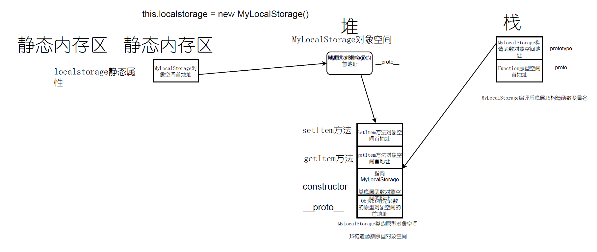
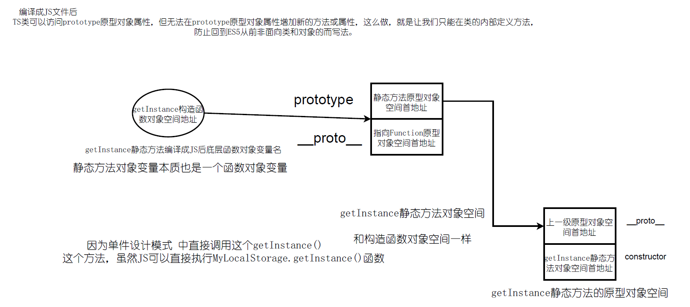

# 单件设计模式

## 了解设计模式

设计模式通俗的讲，就是一种更好的编写代码方案，打个比喻：从上海到武汉，你可以选择坐飞机，坐轮船，开车，骑摩托车多种方式，把出行看成是编码，那么选择飞机相对就是一个更好选择的优化方案。

## 常见设计模式概述

常见的设计模式有单件设计模式，简单工厂设计模式，工厂方法，抽象工厂设计模式，观察者设计模式，装饰设计模式，代理设计模式，MVC，MVP, MVVM 架构设计模式。

只讲解单件设计模式，原因有两个：
1. 设计模式并非 TypeScript 课程的重点，我们要把更多时间留给TS核心技能。
2. 单件设计模式虽短小精悍，但能更好的帮助掌握 TS 类，类的静态方法，类构造器，类对象的联合运用。

## 单件设计模式的两种定义和定义中的存在的陷阱

**简明定义1**：一个类对外有且仅有一个实例【只提供一个实例】，这种编码方案就是单件设计模式。

**完整定义1**：如果某个类对外始终只提供一个对象【实例】，并且在该类的内部提供了一个外部访问该对象的方法或该对象属性，那么这种编写代码方案【就是设计模式】就是单件设计模式。

**完整定义2**：如果一个类的任何外部通过访问类提供的某个方法或某个属性始终只能获取该类一个对象【实例】，但如果该类提供了多个外部可以访问的方法或属性，那么外部就能访问到该类的多个不同的对象，但从实际开发来看，绝大多数情况的应用场景，我们对外都只提供一个唯一的可以访问的方法或属性，这样就保证了实例为单个，类的这种编写代码的方案【就是设计模式】就是单件设计模式。

哪一种定义对？

## 何时需要使用单件设计模式？

实际开发中，外部访问某个类的对象【实例】时，确保只能访问该类的唯一对象时才能保证逻辑的正确性时，这时就应该使用单件设计模式了。

## 前端领域单件设计模式的真实应用场景

**应用场景1：** 比如 Vuex，React-Redux 中的全局状态管理容器 store 对象在整个项目被设计成唯一的对象【实例】，把 store 对象所在 的类设计成单件设计模式将是最好的设计方案 【当然也可以有其他替代写法】

**应用场景2：** 一般前端项目需要进行客户端本地数据存储时，都会考虑使用 localStorage，localStorage只要在相同的协议、相同的主机名、相同的端口下，就能读取/修改到同一份 localStorage 数据。那封装 localStorage设计成一个单件设计模式类就再合适过了。【尽管也可以其他写法，但依然存在问题，编码时我们会给同学们说明】。

**应用场景3：** 我们知道项目日志记录是一个项目中必不可少的环节，当我们为一个项目编写一个日志文件类，用来保存日志和阅读日志信息时，这个日志文件类可以有多种设计方案，但把类写成单件模式是最好的方案，因为每次存储日志信息到日志文件上时都创建一个日志对象，这既没有必要，也很浪费内存空间。

## 【单件设计模式】 单件设计模式实战【真实应用场景】编码实现

**【单件设计模式】 融合单件设计模式深入掌握静态属性，静态方法**

**（1）懒汉式单件设计模式：** 懒汉式单件设计模式是在你真正用到类的实例时才创建这个唯一的对象。

**（2）逐点掌握静态属性，静态方法 【静态成员=静态属性+静态方法】的特点**

**1. 外部如何调用 TS 类的静态成员？** 答：类名直接调用静态成员，格式：类名.静态属性  类名.静态方法。

**2. TS类的一个静态方法如何调用其他的静态成员？** 答：使用 this 来获取静态成员。

**3.  静态方法是否可以访问类中原型对象上的方法或对象属性【对象基本类型数据+对象引用属性】，反过来呢?**  答：都不能。

**4.  对象变量是否可以访问静态成员？** 答：不能。

**5. 一个静态方法改变了某个静态属性，其他静态方法或类外部任何地方访问这个属性都会发生改变。**

**6.  静态成员保存在内存哪里？何时分配的内存空间呢？**

答：任何一个 TS 类中的静态成员存储在内存的静态区，运行一个 TS 类，TS首先会为静态成员开辟内存空间，静态成员的内存空间分配的时间要早于对象空间的分配，也就是任何一个对象创建之前 TS 就已经为静态成员分配好了空间。但一个静态方法或静态属性只会分配一个空间，只要当前服务器不重启或控制台程序还没有结束之前【如果是开发期间临时测试，一般用控制台】，那么静态方法或者是静态属性就一直存在内存空间，无论调用多少次这个静态方法或静态属性，都是调用的同一块空间。

**总结静态方法**，两点：

**总结1：** 无论你是否创建对象，创建多少个对象，是否调用该静态方法或静态属性，TS都会为这个静态方法或静态属性分配内存空间，注意：静态成员和对象无关。

**总结2：**一旦为静态方法或静态属性分配好空间，就一直保存到内存中，直到服务器重启或者控制台程序执行结束才被释放。

**彩蛋**：new 一个 TS 类的方法可以吗？能在TS 类外部使用 prototype为TS类增加方法或属性吗?

虽然在 JS 中可以 new 一个类【构造函数】内部定义的对象方法或静态方法，但TS已经屏蔽了去new 一个类中的方法【 JS 可以，会当成一个构造函数】，TS 类可以访问 prototype 原型对象属性，但无法在 prototype 原型对象属性增加新的方法或属性，这么做，就是让我们只能在类的内部定义方法，防止回到 ES5 从前非面向类和对象的写法。【但是可以覆盖类上已经存在的方法】

**7.   静态方法或属性和原型对象空间上的方法或属性有何区别？**

答：原型对象空间上的方法和属性用来提供给该类的所有对象变量共用的方法或属性，没有对象和对象变量，原型上的属性和方法就没有了用武之地，而静态方法或静态属性属于类，可以通过类来直接访问。任何一个对象创建之前 TS 就已经为静态成员分配好了空间。但一个静态方法或静态属性只会分配一个空间，而每一个对象都有自己独立的空间。

**8.  静态方法是否可以接受一个对象变量来作为方法的参数？**

答：可以，静态方法内部不能通过this来访问对象属性和方法，但可以通过调用静态方法时把对象变量传递给静态方法来使用。比如：我们把 js 的 Object 构造函数想象成一个 TS 类【实际 TS 类编译后的 JS 文件中就变成了一个构造函数】。Object 类就拥有大量的静态方法，例如：apply，call，bind，keys等，现在我们来关注静态方法是否可以接受对象变量作为方法的参数，我们以Object.keys方法为例 【Object类的keys方法用来获取给定对象的自身可枚举属性组成的数组】。

```js
// 我们现在把 Object 构造函数看成一个 Object 类，创建 Object 类的对象。
let obj = new Object({ username: "wangwu", age: 23 })//1
let obj2 = { username: "wangwu", age: 23 }// 2是1的简写
// 把 obj 对象变量传递给 keys静态方法，obj对象变量作为 keys 静态方法的参数
Object.keys(obj2)
```

**9.  何时应该把一个方法定义成静态方法或属性定义为静态属性呢？【应用】**

答：

**应用1：单件设计模式就是静态方法和静态属性很好的应用场景之一。** 当外部不能创建对象，就只能借助类内部的静态方法来获取类的对象；这时肯定不能把这个方法定义成原型对象属性上的方法，只能定义为类的静态方法，因为如果定义成原型对象属性的方法，就会导致外部无法被访问，因为外部根本不能创建对象，也就无法访问原型对象属性上的方法。而静态方法要访问的属性就只能是静态属性了，这也是静态属性的应用时机。

​**应用2：当类中某个方法没有任何必要使用任何对象属性时，而且使用了对象属性反而让这个方法的逻辑不正确，那既如此，就应该禁止这个方法访问任何对象属性和其他的对象方法，这时就应该把这个方法定义为静态方法。**例如：一个顾客类的购买方法【 buy 方法】中肯定要允许访问顾客姓名或其他顾客微信这些对象属性，这样的方法我们就**需要定义在原型对象属性**上，但如果顾客类中的 阅读顾客积分公告方法【 readNotice 方法] 是针对全体顾客的公告方法，就应该定义为静态方法，方法内部就应该禁止出现任何具体的对象属性。如果在这样的方法中使用了顾客的某个属性，比如用了顾客姓名，那么这个方法逻辑就不正确【**这个方法就会说：你让我向全体顾客展示公告，你我要知道每个顾客姓名做什么？**】。所以我们应该让这样的方法禁止访问对象属性和其他的对象方法，那就应该设置为静态方法。

**应用3：** 当一个类中某个方法只有一个或者 1-2个 对象属性，而且更重要的是，你创建这个类的对象毫无意义，我们只需要使用这个类的一个或者多方法就可以了，那么这个方法就应该定义为静态方法。常见的工具类中的方法通常都应该定义为静态方法。比如 StringUtil, FileUtil 等，我们以 FileUtil 为例进行讲解

**思考题**：定义一个文件工具类【 FileUtil 】，编写一个读取文件方法【readFile方法】方便外部调用，那这样的方法应该定义为静态方法吗？

答：定义在原型属性上和定义为静态方法似乎都可以，只要 readFile 方法获取到外部提供文件名就可以展开文件读写。请看下面两段代码，我们仔细比较后再来决定用哪一种方案？

```js
class FileUtil{
	// 从指定文件上把数据读出来打印在控制台或页面上的静态方法
   public static readFile(readonly fileName:string){
      fs.readFile(fileName, (err: any, data: any) => {
          console.log("fs.readFile:", data.toString());
      }
   }
  // 把键盘输入的数据或页面上获取的数据写入到指定文件上的静态方法
   public static writeFile(fileName:string){
       fs.writeFile(fileName, '刘老根4', function (error) {
          if (error) {
            console.log('写文件失败')
          } else {
            console.log('写文件成功')
          }
	})

 }
 // 实际应用中，读和写一般都不在一个时间段，可能读功能完成后，过了几分钟，用户才在客户端执行写的方法，
 // 又过了一会，用户又在客户端执行了读的方法。 但我们知道静态方法实际上是一直保存到内存空间，这样反复操作其实节省了大量反复创建 和释放 FileUtil 对象的时间和对应的对象内存空间。
 FileUtil.readFile('./log.txt')
 FileUtil.writeFile('./log5.txt')
```

```js
class FileUtil{
   constructor(public fileName:string){}

   // 从指定文件上把数据读出来打印在控制台或页面上的静态方法
   public  readFile(){
      fs.readFile(fileName, (err: any, data: any) => {
          console.log("fs.readFile:", data.toString());
      }
   }

    // 把键盘输入的数据或页面上获取的数据写入到指定文件上的静态方法
    public writeFile(fileName:string){
       fs.writeFile(fileName, '刘老根4', function (error) {
          if (error) {
            console.log('写文件失败')
          } else {
            console.log('写文件成功')
          }
	})
 }
 // 实际应用中，读和写一般都不在一个时间段，可能读功能完成后，过了几分钟，用户才在客户端执行写的方法，
 // 又过了一会，用户又在客户端执行了读的方法。所以每次都要创建 FileUtil 对象，这样反复创建 和释放  FileUtil 对象，就浪费了大量反复创建 和释放 FileUtil 对象的时间和对应的对象内存空间
 new FileUtil('./log.txt').readFile()
 new FileUtil('./log5.txt').writeFile()
```

10.  对于第 9 项思考题中的关于使用静态属性或静态方法的解决方案绝对不能用在学生，顾客其他应用场景，那样会导致三个比较严重的问题，以学生对象为例：

1. 浪费了很多不必要的内存空间

运行一开始就为大量的静态属性和大量的静态方法分配内存空间【但很可能某个静态方法一直没有使用，白白的一直占用着内存空间】

2. 无法展示一个学生一个对象的直观效果，完全失去了对象来描述实体的优势！

3.  最严重的问题是：属性值一变则都变

所有操作都在用一个静态方法空间来完成某种功能，一旦某个操作改变了静态方法中的某个值，比如改变了学生姓名，则其他操作访问到这个静态变量看到的结果全变了。

## 单件设计模式实现方式

**（1）饿汉式单件设计模式定义**

饿汉式单件设计模式是无论你是否用到了对象【实例】，一开始就建立这个唯一的对象。

**（2）懒汉式单件设计模式实现步骤**

 构建单件设计模式[懒汉式[等到需要使用对象时才创建对象,按需创建]单件设计模式 ]

 第一步：把构造器设置为私有的，不允许外部来创建类的实例【对象】

 第二步: 至少应该提供一个外部访问的方法或属性，外部可以通过这个方法或属性来得到一个对象

 所以应该把这个方法设置为静态方法

 第三步：外部调用第二步提供的静态方法来获取一个对象

```js
class MyLocalStorage {
  // 静态属性和对象属性[实例属性】是类中两大成员
  static localstorage: MyLocalStorage//引用静态属性
  private constructor() {
    console.log("这是TS的单件设计模式的静态方法的构造器");
  }
  // 提供一个外部访问的方法,
  // 通过这个方法用来提供外部得到一个对象的方法
  //   1. 带static关键字的方法就是一个静态方法
  //   2. 静态方法和对象无关，外部的对象变量不能调用静态方法和静态属性，
  //   3. 外部可以通过类名来调用
  //   静态方法不可以访问实例属性或实例方法【对象属性或对象方法】
  public static getInstance() {
    // let localstorage = new MyLocalStorage();
    // return localstorage
    // return new MyLocalStorage();
    // 使用局部变量来解决 失败了
    // let localstorage
    // if (!localstorage) {
    //   localstorage = new MyLocalStorage();
    // }
    // return localstorage
    //this.setItem
    // if(!false){ undefined null 0 false

    //}
    if (!this.localstorage) {//如果静态对象属性指向创建对象
      console.log("我是一个undefined的静态属性，用来指向一个对象空间的静态属性")
      this.localstorage = new MyLocalStorage()

    }

    return this.localstorage
  }

  public test() {

  }
  // public static getInstanceNew(){
  //   this.
  // }
  // 保存key-value
  public setItem(key: string, value: any) {

    localStorage.setItem(key, JSON.stringify(value))
  }


  public getItem(key: string) {

    let value = localStorage.getItem(key)
    return value != null ? JSON.parse(value) : null;

  }
}
```

```ts
import MyLocalStorage from './Mylocalstorage'

let obj = MyLocalStorage.getInstance();
let localstorage = new MyLocalStorage()
//localstorage.
```





**（3）饿汉式单件设计模式实现步骤**

​构建单件设计模式[饿汉式单件设计模式 立即创建对象]

​第一步：把构造器设置为私有的，不允许外部来创建类的实例【对象】

​第二步: 建立一个静态引用属性，同时把这个静态引用属性直接指向一个对象【 new MyLocalStorage()】

​第三步：外部调用第二步提供的静态方法来获取一个对象

```js
class MyLocalStorage {
  // 对象属性【对象的基本类型属性和对象的引用属性】
  // 静态属性【静态的基本类型属性和静态的引用属性】
  static localstorage: MyLocalStorage = new MyLocalStorage();
  static count: number = 3
  private constructor() {
    console.log("这是TS的单件设计模式的静态方法的构造器");
  }

  public setItem(key: string, value: any) {

    localStorage.setItem(key, JSON.stringify(value))
  }


  public getItem(key: string) {

    let value = localStorage.getItem(key)
    return value != null ? JSON.parse(value) : null;

  }
}
```
