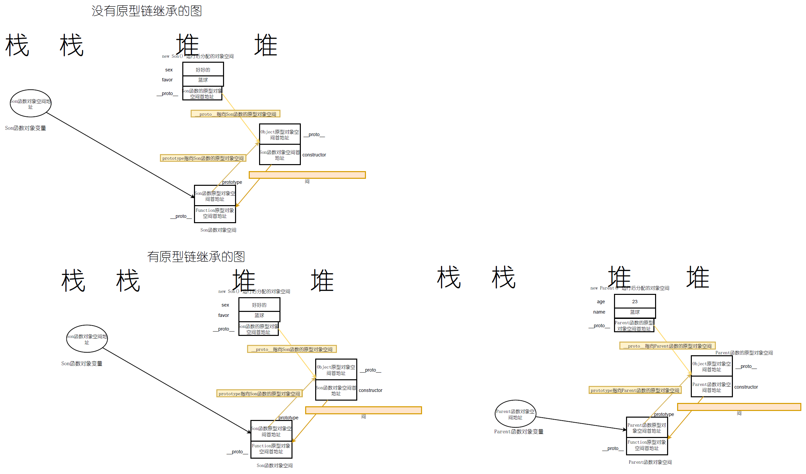
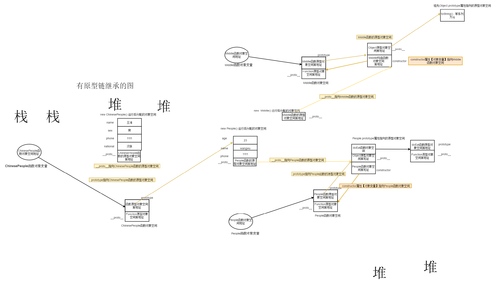
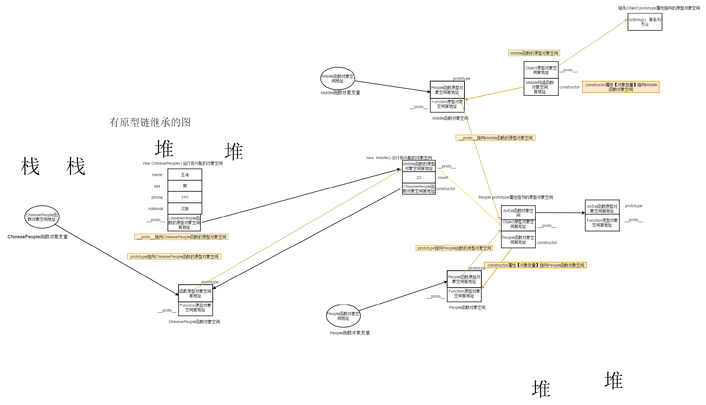

# TS 继承深入+手写优化底层源码

## 前端深度掌握TS继承的重要丶长远意义

**练就更深厚的 JS 原型，原型链功底**

TS编译后的JS中有经典的JS原型和原型链的源码实现，虽然稍显复杂，但源码并不长，这将是 练就 更深厚的 JS 原型，原型链功底的绝佳场景。这不仅让你日后面试大受益，而且也为你能阅读Vue3,React 源码或其他流行框架源码铺路，因为不管是那种源码，JS原型链继承一定会用到，再加上你的TS功底，那么这些都成让你日后前端之路走的更远，走的更高！

**提升前端项目架构的根基技术**

如果要你现在用开发一个工具库，组件库，你打算怎么开发 ? 可以写出n多个版本的代码，都可以实现，但版本和版本之间的价值却差别巨大，你可以用 JS 原型写出1年左右工作经验的前端水准的代码，当然，上乘之选肯定是用 TS 来开发，你也可以灵活运用TS继承，多态等多种技术写出高水准的代码。但如果你不具备后端思维能力，就算你工作了5年，你也不一定能有这样的思维，甚至随时有可能被一个拥有了后端思维的只有1到2年工作经验水准的前端工程师超越。

**突破前端技术瓶颈之一的技能**，**晋级中高级前端工程师必会技能**

如果你只掌握了单个类的使用，而不知道如何运用继承，那这也是技能缺失，将会限制你日后技术发展的高度，限制你的技术视野，让你的前端变得过于前端化。

说深度掌握了 TS 继承就能突破所有的前端技术瓶颈，那很显然是夸大其词，但要想突破前端技术瓶颈，深度掌握继承必然是其中一项技能，而且是根基技术之一，可见继承的重要性不言而喻。

比如一个简单的汽车租赁项目，让你来实现，你把前端功能实现了，展示在页面上了，但是打开你用 TS 写的 Vuex 代码，用 TS 写的 Nodejs 代码，过于前端化的思维让你编写的代码可能让人不堪入目。这里不单单是说用到封装继承，多态，解耦这些技术，更多的是你过于前端化的思维编写的项目可扩展性将非常差，可读性也差，可重用性【复用性】也低，而这些是评判一个项目是否值钱的关键因素。

如果你希望未来职业生涯拥有更广阔的技术视野；更远的未来你甚至希望自己能胜任技术总监，那么你就一定从一个更广阔的技术视野来提升自己的技术能力，不能让自己被框在过于前端化的路上。

虽然不能三言两语描述出什么才叫完全突破前端瓶颈，但有一点是可以肯定的，就是要有一定的后端思维能力，这里当然不是要拥有 Java 后端能力，而是起码具备 Nodejs 后端的项目架构能力，Nodejs 可以前端工程师提升晋级一定要掌握的技能。而深度掌握了 TS 继承已经为突破前端技术瓶颈开了一个好头。

## 深度掌握TS继承准备：原型链继承+常见疑问+**容易被遗忘的重要一步**

**（1）原型链继承实现原理：**

**说明：Parent 类是【父构造函数】 Son 类是【子构造函数】**

原型链继承基本思想就是Son 类的原型对象属性【 Son.prototype 】指向 new  Parent( )。即

```ts
function Parent(name,age){
    this.name=name
    this.age=age
}
function Son(favor,sex){
    this.favor=favor // 兴趣爱好
    this.sex=sex
}
Son.prototype=new  Parent("好好的",23) // 98
let sonObj=new Son("篮球","男")
```

```ts
function Parent (name, age) {
  this.name = name
  this.age = age
}
Parent.prototype.friends = ["xiaozhang", "xiaoli"]
Parent.prototype.eat = function () {
  console.log(this.name + " 吃饭");
}
function Son (favor, sex) {
  this.favor = favor // 兴趣爱好
  this.sex = sex
}
let parent = new Parent("王五", 23);
console.log("parent:", parent)
let sonobj = new Son("打篮球", "男");
console.log("sonobj:", sonobj)

console.log("Son.prototype:", Son.prototype)

//Son.prototype = new Parent("王六", 38);
Son.prototype = Parent.prototype;
//导致的问题: S199执行后会让Son.prototype
// 和Parent.prototype和sonobj2.__proto指向的原型对象空间
// [Parent.prototype指向的原型对象空间]指向Son构造函数对象空间
//  这违背了Parent原型对象空间中的constructor属性必须指向Parent构造函数对象空间
Son.prototype.constructor = Son;// S199 让Son类的对象或函数原型.prototype指向的原型对象空间
//【new Parent()对象空间】有一个constructor属性指向Son构造函数对象空间

console.log("Parent.prototype:", Parent.prototype)
console.log("Son.prototype 原型链继承之后的指向:", Son.prototype)
let sonobj2 = new Son("打篮球", "男");
console.log("sonobj2:", sonobj2)
console.log("sonobj2访问son类自身的favor属性【构造函数中this定义的对象属性】:",
  sonobj2.favor)
console.log("sonobj2访问son对象原型上的name属性:", sonobj2.name)
console.log("sonobj2访问friends属性:", sonobj2.friends)
```

原型链继承实现的本质是改变Son构造函数的原型对象变量的指向【 就是Son.prototype的指向 】，Son.prototype= new  Parent ( )。那么 Son.prototype 可以访问  Parent 对象空间的属性和方法。所以顺着 `__proto__ ` 属性 ，Son类也可以访问 Parent 类 的原型对象空间中的所有属性和方法。

原型链继承查找属性和方法的完整路线描述: 子对象首先在自己的对象空间中查找要访问的属性或方法，如果找到，就输出，如果没有找到，就沿着子对象中的 `__proto__` 属性指向的原型对象空间中去查找有没有这个属性或方法，如果找到，就输出，如果没有找到，继续沿着原型对象空间中的 `__proto__`  查找上一级原型对象空间中的属性或方法，直到找到Object.prototype原型对象属性指向的原型对象空间为止，如果再找不到，就输出null

**（2）原型链继承实现容易被遗忘的重要一步**

```ts
Son.prototype.constructor = Son
```

```ts
function Parent (name, age) {
  this.name = name
  this.age = age
}
Parent.prototype.friends = ["xiaozhang", "xiaoli"]
Parent.prototype.eat = function () {
  console.log(this.name + " 吃饭");
}
function Son (favor, sex) {
  this.favor = favor // 兴趣爱好
  this.sex = sex
}
let parent = new Parent("王五", 23);
console.log("parent:", parent)
let sonobj = new Son("打篮球", "男");
console.log("sonobj:", sonobj)

console.log("Son.prototype:", Son.prototype)

//Son.prototype = new Parent("王六", 38);
Son.prototype = Parent.prototype;
//导致的问题: S199执行后会让Son.prototype
// 和Parent.prototype和sonobj2.__proto指向的原型对象空间
// [Parent.prototype指向的原型对象空间]指向Son构造函数对象空间
//  这违背了Parent原型对象空间中的constructor属性必须指向Parent构造函数对象空间
Son.prototype.constructor = Son;// S199 让Son类的对象或函数原型.prototype指向的原型对象空间
//【new Parent()对象空间】有一个constructor属性指向Son构造函数对象空间

console.log("Parent.prototype:", Parent.prototype)
console.log("Son.prototype 原型链继承之后的指向:", Son.prototype)
let sonobj2 = new Son("打篮球", "男");
console.log("sonobj2:", sonobj2)
console.log("sonobj2访问son类自身的favor属性【构造函数中this定义的对象属性】:",
  sonobj2.favor)
console.log("sonobj2访问son对象原型上的name属性:", sonobj2.name)
console.log("sonobj2访问friends属性:", sonobj2.friends)
```

**（3） 原型链继承常见疑问**

Son.prototype= Parent.prototype 这样作为原型链继承的模式和 **Son.prototype=new  Parent (...)** 又有什么区别呢？

**（4）原型链继承的不足**

**局限性：不能通过子类构造函数向父类构造函数传递参数**

```ts
function Parent (name, age) {
  this.name = name
  this.age = age
}
Parent.prototype.friends = ["xiaozhang", "xiaoli"]
Parent.prototype.eat = function () {
  console.log(this.name + " 吃饭");
}
function Son (name, age, favor, sex) {
  this.favor = favor // 兴趣爱好
  this.sex = sex

}
// function Son2 (name,age,address, sex) {
//   this.favor = favor // 兴趣爱好
//   this.sex = sex
// }
// function Son3 (name,age,phone, sex) {
//   this.favor = favor // 兴趣爱好
//   this.sex = sex
// }
let parent = new Parent("王五", 23);
console.log("parent:", parent)
let sonobj = new Son("打篮球", "男");
console.log("sonobj:", sonobj)

console.log("Son.prototype:", Son.prototype)

// 原型链继承
// 继承带来的好处
//  子类对象变量可以访问父类的实例属性
//  子类对象变量可以访问父类原型对象空间中的属性和方法
Son.prototype = new Parent("王六", 38);
Son.prototype.constructor = Son;// 让Son类的对象或函数原型.prototype指向的原型对象空间【new Parent()对象空间】有一个constructor属性
// 指向了Son构造函数对象空间

// let prototype={};
// prototype.constructor="abc"
// 等价于 let prototype={constructor:"abc"}
//   let prototype=new Object(){constructor:"abc"}
console.log("Son.prototype 原型链继承之后的指向:", Son.prototype)
let sonobj2 = new Son("lisi", 34, "打篮球", "男");
let sonobj3 = new Son("wukong", 39, "打篮球", "男");
let sonobj4 = new Son("zhangsan", 48, "打篮球", "男");
console.log("sonobj2:", sonobj2)
console.log("sonobj2访问son类自身的favor属性【构造函数中this定义的对象属性】:",
  sonobj2.favor)
console.log("sonobj2访问son对象原型上的name属性:", sonobj2.name)
console.log("sonobj2访问friends属性:", sonobj2.friends)

//  局限性：不能通过子类构造函数向父类构造函数传递参数
```



## 深度掌握 TS 继承准备：借用构造函数（冒充对象继承）

**（1）借用构造函数继承如何解决原型链继承的局限性**

借用构造函数继承思想就是在子类【  ChinesePeople 构造函数】的内部借助 `apply ( )` 和 `call ( )` 方法调用并传递参数给父类【  People 构造函数】，在父类构造函数中为当前的子类对象变量【ChinesePeopl对象变量】增加属性【本例中增加了name】

```js
    function Parent (name, age) {
      this.name = name
      this.age = age
      console.log("this:", this)
      console.log("this.name:", this.name)
    }
    Parent.prototype.friends = ["xiaozhang", "xiaoli"]
    Parent.prototype.eat = function () {
      console.log(this.name + " 吃饭");
    }
    function Son (name, age, favor, sex) {
      this.favor = favor // 兴趣爱好
      this.sex = sex
      Parent.call(this, name, age)// TS继承中使用super
    }
    let sonobj2 = new Son("lisi", 34, "打篮球", "男");
    console.log("sonobj2:", sonobj2)
    console.log("sonobj2.friends:", sonobj2.friends);//undefined，没有继承父类原型的属性和方法，无法访问父类原型上的属性和方法
```

回顾 `apply ( )` 和 `call ( )` 方法：

```ts
let peopleObj = {
  name: '小张',
  ppl_age: this.age,
  eat (address, who) {
    //peopleObj.eat.call(myobj, "王府井", 38)执行以后的输出结果
    // console.log("this:", this)//{ name: '小王', age: 98 }
    // console.log("this.name:", this.name)
    this.address = address;
    this.who = who;
    console.log("this:", this);
    console.log(this.name + " 年龄:"
      + this.age + " 和" + this.who + " 在" + this.address + "吃饭")
    return 3;
  }
}


let myobj = {
  name: '小王',
  age: 98
}
console.log("myobj1:", myobj)
// call和apply方法的使用
// peopleObj.eat.call(myobj, "王府井", 38)
// console.log("myobj2:", myobj)

peopleObj.eat.apply(myobj, ["王府井", 38])//apply传递的是数组
console.log("myobj2:", myobj)
```

**（2）借用构造函数继承的不足**

借用构造函数实现了子类构造函数向父类构造函数传递参数，但没有继承父类原型的属性和方法，无法访问父类原型上的属性和方法。


## 深度掌握 TS 继承准备：借用构造函数+原型链继承组合模式

**（1）借用构造函数+原型链继承组合模式的优势**

**优势1：** 具备借用构造函数的优点：子类【 ChinesePeople 构造函数】的内部可以向父类【  People 构造函数】 传递参数

**优势2：** 具备原型链继承的优点：ChinesePeople.prototype 和 new ChinesePeople( ) 出来的实例对象变量和实例都可以访问父类【  People 构造函数】 原型对象上的属性和方法。

```js
function People(name,sex,phone){// People父构造函数【看成是一个父类】//=Parent
        this.name=name; // 实例属性
        this.sex=sex;
        this.phone=phone
}
People.prototype.doEat=function(){
    console.log(this.name + "吃饭...")
}
function ChinesePeople(name,sex,phone,national){ //=SON
    People.apply(this,[name,sex,phone]);// 借用父构造函数继承
    this.national=national;// 民族
}
ChinesePeople.prototype=new People("wangwu",'男',"1111")
```

```ts
function Parent (name, age) {
  this.name = name
  this.age = age
  // console.log("this:", this)
  console.log("this.name:", this.name)
}
Parent.prototype.friends = ["xiaozhang", "xiaoli"]
Parent.prototype.eat = function () {
  console.log(this.name + " 吃饭");
}
function Son (name, age, favor, sex) {
  this.favor = favor // 兴趣爱好
  this.sex = sex
  Parent.call(this, name, age)// TS继承中使用super
}
Son.prototype = new Parent("temp", 3);
Son.prototype.constructor = Son

let sonobj2 = new Son("lisi", 34, "打篮球", "男");
console.log("sonobj2:", sonobj2)
console.log("sonobj2.friends:", sonobj2.friends);//undefined

// let sonobj3 = new Son("tianping", 34, "打篮球", "男");
// console.log("sonobj3:", sonobj3)
// console.log("sonobj3.friends:", sonobj3.friends);//undefined
```

**（2）借用构造函数+原型链继承组合模式的不足：**

​缺点：调用了**两次**父类构造函数 【 People 构造函数】 new People 调用构造函数带来问题：

1. 进入 People 构造函数为属性赋值，分配内存空间，浪费内存；

2. 赋值导致效率下降一些，关键是new People 赋的值无意义，出现代码冗余，new ChinesePeople出来的对象和这些值毫不相干，是通过子类 ChinesePeople 构造函数中的 apply 来向父类People构造函数赋值。

##  深度掌握 TS 继承准备:  多维授课助深度透彻掌握寄生组合继承【实现方法+优化 】【最佳继承模式】

寄生组合继承模式=借用构造函数继承+寄生继承。

寄生组合继承既沿袭了借用构造函数+原型链继承两个优势，而且解决了借用构造函数+原型链继承调用了两次父类构造函数为属性赋值的不足。寄生组合继承模式保留了借用构造函数继承，寄生组合继承模式使用寄生继承代替了原型链继承。

什么是寄生继承呢？就是 ChinesePeople.prototype 不再指向 new  People( ) 出来的对象空间，而用 People 类 【父构造函数】的原型对象属性“克隆”了一个对象。再让ChinesePeople.prototype指向这个新对象，很好的避免了借用构造函数+原型链继承调用了两次父类构造函数为属性赋值的不足。

初步实现：

```ts
function People (name, sex, phone) {//父类 【父构造函数】
  this.name = name;
  this.sex = sex;
  this.phone = phone;
}

People.prototype.doEat = function () {
  console.log(this.name + "吃饭...")
}

function ChinesePeople (name, sex, phone, national) {//ChinesePeople子类【子构造函数】

  People.call(this, name, sex, phone)
  this.national = national;//民族
}
//寄生组合继承实现步骤
// 第一步: 创建一个寄生构造函数
function Middle () {
  this.count = 23
}

Middle.prototype = People.prototype
// 第二步:创建一个寄生新创建的构造函数的对象
let middle = new Middle();
// 第三步:ChinesePeople子类的原型对象属性指向第二步的新创建的构造函数的对象
ChinesePeople.prototype = middle
ChinesePeople.prototype.constructor=ChinesePeople

let chinesePeopleTwo = new ChinesePeople("王海", "男", "1111", "汉族");
let chinesePeopleOne = new ChinesePeople("约克夏", "女", "1111", "傣族");

console.log("chinesePeopleOne:", chinesePeopleOne);
console.log("chinesePeopleTwo:", chinesePeopleTwo);
```

进一步优化，构建一个共用的寄生组合继承函数【最佳原型继承模式】

```ts
function People (name, sex, phone) {//父类 【父构造函数】
  this.name = name;
  this.sex = sex;
  this.phone = phone;
}

People.prototype.doEat = function () {
  console.log(this.name + "吃饭...")
}

function ChinesePeople (name, sex, phone, national) {//ChinesePeople子类【子构造函数】

  People.call(this, name, sex, phone)
  this.national = national;//民族
}


//寄生组合继承实现步骤
// 构建一个共用的寄生组合继承函数【最佳原型继承模式】
//function createNewProtoypeObj (rootprototype, son) {
// function createNewProtoypeObj (parent, son) {
//   // 第一步: 创建一个寄生构造函数
//   function Middle () {
//     this.count = 23
//     this.constructor = son
//   }
//   Middle.prototype = parent.prototype
//   // 第二步:创建一个寄生新创建的构造函数的对象
//   let middle = new Middle();
//   return middle
// }

// 复用性
// 通用度比Object.create实现寄生组合继承模式更高，灵活度也更高
function _extends (parent, son) {//继承
  // 第一步: 创建一个寄生构造函数
  function Middle () {
    this.count = 23
    this.constructor = son
  }
  Middle.prototype = parent.prototype
  // 第二步:创建一个寄生新创建的构造函数的对象
  let middle = new Middle();//middle.__proto__=parent.prototype
  return middle
}
// let obj={}
// obj.__proto__= parent.prototype
// ChinesePeople.prototype=obj;

let middle = _extends(People, ChinesePeople);
console.log("middle:", middle)
// 第三步:ChinesePeople子类的原型对象空间指向第二步的新创建的构造函数的对象
// ChinesePeople.prototype = createNewProtoypeObj(People.prototype,
//      ChinesePeople);
// ChinesePeople.prototype = createNewProtoypeObj(People,
//   ChinesePeople);
ChinesePeople.prototype = middle
//ChinesePeople.prototype.constructor = ChinesePeople;

let chinesePeopleTwo = new ChinesePeople("王海", "男", "1111", "汉族");
let chinesePeopleOne = new ChinesePeople("约克夏", "女", "1111", "傣族");

console.log("chinesePeopleOne:", chinesePeopleOne);
console.log("chinesePeopleTwo:", chinesePeopleTwo);
```

使用 Object.create：

```ts
function People (name, sex, phone) {//父类 【父构造函数】
  this.name = name;
  this.sex = sex;
  this.phone = phone;
}

People.prototype.doEat = function () {
  console.log(this.name + "吃饭...")
}

function ChinesePeople (name, sex, phone, national) {//ChinesePeople子类【子构造函数】

  People.call(this, name, sex, phone)
  this.national = national;//民族
}

function _extends (parent) {//继承
  let middle = Object.create(parent.prototype, {
    count: {
      writable: true,
      value: 23
    }
  })
  return middle;
}

const middle = _extends(People);
ChinesePeople.prototype = middle
ChinesePeople.prototype.constructor = ChinesePeople//需要额外增加子构造函数指向的原型对象空间中的constructor属性


let chinesePeopleTwo = new ChinesePeople("王海", "男", "1111", "汉族");
let chinesePeopleOne = new ChinesePeople("约克夏", "女", "1111", "傣族");

console.log("chinesePeopleOne:", chinesePeopleOne);
console.log("chinesePeopleTwo:", chinesePeopleTwo);
```

**总结：**

解释 S99 行代码：表示创建了一个新对象，相当用  People  类 【父构造函数】的原型对象属性“克隆”了一个对象。

解释 S100 行代码：让ChinesePeople 原型对象变量指向S99

```js
// "克隆"对象实现方式代码优化 [ TS 继承和装饰器底层继承实现模式]
function createProtoTypeClone(prototypeObject){
    function Middle(){
        // 第四步在新创建的ChinesePeople原型对象空间的Middle实例对象中添加constructor属性
        // 使其指向子类ChinesePeople构造函数对象空间
        this.constructor=ChinesePeople;
        // clone.constructor=ChinesePeople;
    }

    // 第一步.创建Person父类原型的副本
    Middle.prototype=Person.prototype;
    // 第二步2.1:创建父类原型副本的实例对象
    return new Middle();
}

// 第二步2.2 clone指向父类原型副本实例对象的变量
vSonr clone=createProtoTypeClone(Person.prototype);

// 第三步:设置子类原型为该副本的实例对象
ChinesePeople.prototype=clone;


// "克隆"对象实现方式2
// 第S99行效果 = S102+S103。相当用 People 类【父构造函数】的原型对象属性“克隆”了一个对象。
let cloneOneParentObj=Object.create(People.prototype)  // S99
ChinesePeople.prototype=cloneOneParentObj // S100
ChinesePeople.prototype.constructor = ChinesePeople;// S101


// "克隆"对象实现方式3 [思考题]
let cloneOneParentObj2={} // S102
cloneOneParentObj2.__proto__=People.prototype // S103
ChinesePeople.prototype=cloneOneParentObj // S104
ChinesePeople.prototype.constructor = ChinesePeople;// S105

```





## 用全栈眼光深度掌握TS继承+TS继承好处  【企业真项目应用场景】

### 1. 理解子类

（1）什么是子类？

有两个类，比如 A 类和 B 类，如果满足 A 类  is a kind of  B类，那么 A 类就是 B 类的子类
比如：A 类是顾客类，B 类是人类，因为顾客类 a kind of 人类成立【顾客类是人类的一种】，所以顾客类是人类的子类。

（2） 子类如何继承父类的属性和方法？

以顾客类为例子：顾客类继承了父类【人类】的非私有的属性和方法，也具备子类独有的属性和方法 。

顾客类继承父类【人类】的全部非私有的属性和方法外，还有哪些独有的属性和方法呢？
顾客类独有属性：顾客等级，顾客编号
顾客类独有方法：购买

  (3)  初步理解为什么要用继承？

 举例：宠物管理项目中的狗狗类，兔子类，小猫类都是宠物，尽管每个宠物都有独有属性和方法，比如狗狗类的品种，看家方法；兔子类的肤色属性等。但这些类都包含了 name, buymoney[购买价格]，healthstatus[健康状况]，friendshipstar [和主人的友谊星级数]这些属性，如果每一个类都写这些属性，那么就非常臃肿，可以把这些属性提取出来放到一个宠物类中，其他类都继承这个宠物类。当然继承还有更多好处，下面借助汽车租赁功能的实现来更深度的掌握继承。

 (4)  汽车租赁管理功能【深度掌握继承】

需求1:汽车租赁功能实现: 有小轿车,大巴,卡车三种类型的车,顾客可以租任意一种或多种不同类型的车,按照租用的天计算租金， 同时为了响应国家对各类车安全的管理, 对在租赁期内有过各种超载，超乘客数，酒后驾车等违规的车需额外支付一定的费用。

需求2:计算退回费用：最终退回顾客的费用为押金扣除使用天数，如押金不足需额外支付不足部分。

思考小轿车,大巴,卡车共同属性:  品牌 ( brand )  VechileNo ( 车牌号 )  days ( 租赁天数 ) total ( 支付的租赁总费用 )  deposit ( 押金 )

思考小轿车,大巴,卡车共同方法: 计算租赁车的价格 ( calculateRent)   支付押金的方法( payDesposit)

安全规则方法（safeShow)

父类：Vechile   交通工具。

子类 小轿车 【型号】type属性

```ts
// 需求1:汽车租赁功能实现: 有小轿车,大巴,卡车三种类型的车,顾客可以租任意一种或多种不同类型的车,按照租用的天计算租金， 同时为了响应国家对各类车安全的管理, 对在租赁期内有过各种超载，超乘客数，酒后驾车等违规的车需额外支付一定的费用。
// 需求2:计算退回费用：最终退回顾客的费用为押金扣除使用天数，如押金不足需额外支付不足部分。
// 思考小轿车,大巴,卡车共同属性:  品牌 ( brand )  vechileNo ( 车牌号 )  days
// ( 租赁天数 ) total ( 支付的租赁总费用 )  deposit ( 押金 )
// 思考小轿车,大巴,卡车共同方法: 计算租赁车的价格 ( calculateRent)
//  支付押金的方法( payDesposit)
// 		安全检测方法（safeShow)

// 父类：Vechile   交通工具。
class Vechile {
  static count: number = 3;
  public brand: string; // 品牌
  public vechileNo: string; // 车牌号
  public days: number; // 租赁天数
  public total: number = 0; // 支付的租赁总费用
  public deposit: number; // 押金
  constructor(
    brand_: string,
    vechileNo_: string,
    days_: number,
    deposit_: number
  ) {
    this.brand = brand_;
    this.vechileNo = vechileNo_;

    this.days = days_;
    this.deposit = deposit_;
    console.log("constructor Vechile=>this.brand:", this.brand);
  }
  // 计算租赁车的价格 ( calculateRent)
  public calculateRent() {
    console.log("calculateRent来自Vechile=>this.brand:", this.brand);

    console.log(this.brand + " 车牌号为:" + this.vechileNo + "开始被租");
    return 0;
  }
  //支付押金的方法( payDesposit)
  payDesposit() {
    console.log(
      this.brand + " 车牌号为:" + this.vechileNo + " 支付了:" + this.deposit
    );
  }

  //  安全检测方法（safeShow)
  public safeShow() {
    console.log("车规则....");
    console.log(this.brand + " 车牌号为:" + this.vechileNo + " 违规了:");
  }
}

// 子类Car类 独有属性为type_
class Car extends Vechile {
  // public brand: string = "nobrand"
  public type: string; //车的型号
  constructor(
    brand_: string,
    vechileNo_: string,
    days_: number,
    deposit_: number,
    type_: string
  ) {
    //  Vechile.call(this,brand_, vechileNo_, days_, total_, deposit_)
    super(brand_, vechileNo_, days_, deposit_);
    this.type = type_;
  }
  // 根据车的型号来获取租用一天该型号车的租金
  public getPriceByType() {
    let rentMoneyByDay: number = 0; //每天的租金
    if (this.type === "普拉多巡洋舰") {
      rentMoneyByDay = 800;
    } else if (this.type === "凯美瑞旗舰版") {
      rentMoneyByDay = 400;
    } else if (this.type === "威驰智行版") {
      rentMoneyByDay = 200;
    }
    return rentMoneyByDay;
  }

  // private 是私有的访问修饰符 只允许在本类中方法
  //protected 是受保护的访问修饰符【修饰符是用来控制方法或属性访问的范围】
  // 可以被本类和子类中使用，不能在类的外部使用
  //  public // 可以被本类和子类中使用，也可以在类的外部使用 默认是public
  public calculateRent() {
    //方法重写 [override]
    // this.safeShow();// 寄生组合继承模式 middle()
    super.calculateRent(); //=Vechile.prototype.calculateRent.call(this)
    console.log("Car:", Car.count);
    console.log("this.brand:", this.brand);
    return this.days * this.getPriceByType();
  }
  checkIsWeigui(isOverWeight: boolean) {
    if (isOverWeight) {
      this.total = this.total + 500;
    }
  }
}

let car = new Car("普拉多", "京3A556", 3, 100000, "凯美瑞旗舰版");
console.log(car.calculateRent());

class Bus extends Vechile {
  public seatNum: number; // 座位数
  constructor(
    brand_: string,
    vechileNo_: string,
    days_: number,
    deposit_: number,
    seatNum_: number
  ) {
    //  Vechile.call(this,brand_, vechileNo_, days_, total_, deposit_)
    super(brand_, vechileNo_, days_, deposit_); //使用父类的构造函数的好处
    this.seatNum = seatNum_;
    if (this.seatNum > 200) {
      throw new Error("座位数不能超过200");
    }
  }

  public getPriceBySeatNum() {
    //计算租赁价格
    let rentMoneyByDay: number = 0; //每天的租金
    if (this.seatNum <= 16) {
      rentMoneyByDay = 800;
    } else if (this.seatNum > 16) {
      rentMoneyByDay = 1600;
    }
    return rentMoneyByDay;
  }
  public calculateRent() {
    super.calculateRent();
    return this.days * this.getPriceBySeatNum();
  }
  checkIsOverNum(isOverWeight: boolean) {
    if (isOverWeight) {
      this.total = this.total + 2000;
    }
  }
}

class Truck extends Vechile {
  ton!: number; // 座位数
  constructor(
    brand_: string,
    type_: string,
    days_: number,
    deposit_: number,
    ton_: number
  ) {
    super(brand_, type_, days_, deposit_);
    this.ton = ton_;
    if (this.ton < 300 || this.ton > 2000) {
      throw new Error("吨数在300-2000吨之间");
    }
  }

  checkIsOverWeight(isOverWeight: boolean) {
    if (isOverWeight) {
      console.log("超载了");
      this.total = this.total + 2000;
    }
  }

  CalRentPrice() {
    //计算租赁价格
    let rentMoneyByDay: number = 0; //每天的租金
    if (this.ton <= 500) {
      //500吨
      rentMoneyByDay = 750;
    } else if (this.ton > 500) {
      rentMoneyByDay = 1350;
    }
    return rentMoneyByDay;
  }
  public calRent() {
    return this.CalRentPrice() * this.days;
  }
  public calDesposit() {
    return this.deposit;
  }
}

class Customer {
  public rentVechile() {}
}

export {};
```

## 【 TS 继承】   super+方法重写的真应用

**方法重写：**（override)

**条件**：一定发生在继承的子类中

**位置**： 子类中重写父类的方法

**应用场景**：当父类中方法的实现不能满足子类功能需要或不能完全满足子类功能需要时，就需要在子类中进行重写

**方法重写给继承带来的好处**: 让所有的子类共用父类中方法已经实现了一部分功能的代码【父类方法代码在各个子类中得到了复用】

**定义规则**：

1. 和父类方法同名
2. 参数和父类相同，如果是引用类型的参数，需要依据具体类型来定义。
3. 父类方法的访问范围【访问修饰符】必须小于子类中方法重写的访问范围【访问修饰符】，同时父类方法不能是private

**super的两种用法**【super只能出现在子类【派生类】中】

**用法1**：在子类的构造函数中使用 super (子类传递给父类构造函数的参数) 就表示用来调用父类构造函数  (传递给父类构造函数的参数)

还记得吗？super 编译成 JS 源码后 可以看到：就是采用 JS 原型中的借用构造函数来实现的

**用法2**：在子类重写的方法中调用父类同名方法，super.重写的方法

**错误用法**：当子类和父类有同名`属性`时，可以在子类中用 super 来获取父类同名属性吗？【不能】【一般要避免在子类，父类属性名同名】


## 【 TS 继承】   逐行深度剖析 +手写TS 继承编译的 JS 源码 【练就更深厚JS 原型+原型继承功底的绝佳场景 ]

**(1) 相关技术**：setPrototypeOf 使用+ 和 Object.create 的区别；

```ts
function People (name, sex, phone) {//父类 【父构造函数】
  this.name = name;
  this.sex = sex;
  this.phone = phone;
}

People.prototype.doEat = function () {
  console.log(this.name + "吃饭...")
}

function ChinesePeople (name, sex, phone, national) {//ChinesePeople子类【子构造函数】

  People.call(this, name, sex, phone)
  this.national = national;//民族
}

ChinesePeople.prototype.getHukou = function () {
  console.log("Hukou");
}
let chinesePeopleTwo2 = new ChinesePeople("王海", "男", "1111", "汉族");
chinesePeopleTwo2.getHukou();
// ES6( Object.setPrototypeOf方法)
// Object.setPrototypeOf() 为现有对象设置原型，返回一个新对象
// 接收两个参数：第一个是现有对象，第二是原型对象。
// 返回的新对象newmiddle和第二个原型对象关系为
// newmiddle.__proto__=parent.prototype
// 由于setPrototypeOf的作用
//  middle.__proto__= parent.prototype
//  newmiddle最终的结果就是middle
function _extends (parent) {//继承
  let middle = { count: 23 }
  //let newmiddle = Object.setPrototypeOf(middle, parent.prototype)
  return Object.setPrototypeOf(middle, parent.prototype)
  //console.log("_extends=>middle:", middle)
  //console.log("_extends=>newmiddle:", newmiddle)
  //newmiddle.__proto__=parent.prototype
  // middle.__proto__=parent.prototype
  // return newmiddle
  //return middle
}

let middle = _extends(People);
ChinesePeople.prototype = middle
ChinesePeople.prototype.constructor = ChinesePeople//需要额外增加子构造函数指向的原型对象空间中的constructor属性


let chinesePeopleTwo = new ChinesePeople("王海", "男", "1111", "汉族");
let chinesePeopleOne = new ChinesePeople("约克夏", "女", "1111", "傣族");
chinesePeopleTwo.getHukou();
console.log("chinesePeopleOne:", chinesePeopleOne);
console.log("chinesePeopleTwo:", chinesePeopleTwo);
```

进一步优化：
```ts
function People (name, sex, phone) {//父类 【父构造函数】
  this.name = name;
  this.sex = sex;
  this.phone = phone;
}

People.prototype.doEat = function () {
  console.log(this.name + "吃饭...")
}

function ChinesePeople (name, sex, phone, national) {//ChinesePeople子类【子构造函数】

  People.call(this, name, sex, phone)
  this.national = national;//民族
}

ChinesePeople.prototype.getHukou = function () {
  console.log("Hukou");
}
// ES6( Object.setPrototypeOf方法)
// Object.setPrototypeOf() 为现有对象设置原型，返回一个新对象
// 接收两个参数：第一个是现有对象，第二是原型对象。
// 返回的新对象newmiddle和第二个原型对象关系为
// newmiddle.__proto__=parent.prototype
// 由于setPrototypeOf的作用
//  middle.__proto__= parent.prototype
//  newmiddle最终的结果就是middle
function _extends (son, parent) {//继承

  return Object.setPrototypeOf(son.prototype, parent.prototype)
  //son.prototype.__proto__ = parent.prototype
  ChinesePeople.prototype.__proto__ = People.prototype
}

_extends(ChinesePeople, People);
//let middle = _extends(People);
//ChinesePeople.prototype = middle
//ChinesePeople.prototype.constructor = ChinesePeople//需要额外增加子构造函数指向的原型对象空间中的constructor属性

// chinesePeopleTwo.__proto__ = ChinesePeople.prototype
// chinesePeopleTwo.__proto_.__proto__ = ChinesePeople.prototype.__proto__
let chinesePeopleTwo = new ChinesePeople("王海", "男", "1111", "汉族");
let chinesePeopleOne = new ChinesePeople("约克夏", "女", "1111", "傣族");
chinesePeopleTwo.getHukou();
console.log("chinesePeopleOne:", chinesePeopleOne);
```

**(2) 父类静态方法和属性在子类中的继承**：setPrototypeOf 和  Object.create 分别实现；

```ts
function RootClass () {

}
RootClass.rootname = "rootname"


function People (name, sex, phone) {//父类 【父构造函数】
  this.name = name;
  this.sex = sex;
  this.phone = phone;
}
People.__proto__ = RootClass
//TS类 双重性质  即是类型【new实例时TS类是类型】 当用TS类直接获取属性时就是对象

//JS函数 双重性质  即是类型【new实例时JS函数也是类型】 当用JS类直接获取属性时就是对象
//  JS函数为对象时，可以获取哪些属性呢？【包括prototype,__proto__,自己定义的静态属性】
People.count = 300;// 静态属性 相当于TS类中static属性
People.commonDescribe = function () {// 静态方法 相当于TS继承中static方法
  console.log("需要守法")
}
//People.__proto__
People.prototype.doEat = function () {
  console.log(this.name + "吃饭...")
}
let people = new People("wangw", 23, "111");
console.log("people:", people)
function ChinesePeople (name, sex, phone, national) {//ChinesePeople子类【子构造函数】

  People.call(this, name, sex, phone)
  this.national = national;//民族
}

// ES6之前的实现
// 第一种方式 ：函数以对象形式呈现时，上面自有属性就是静态属性，上面自有方法就是静态方法
// for (let key in People) {//自有属性 还会查找__proto__指向的对象空间【这里是rootClass函数对象空间】中自有属性
//   console.log("key:", key);//静态属性和静态方法
// }

for (let key in People) {//自有属性 还会查找__proto__指向的对象空间【这里是rootClass函数对象空间】中自有属性
   if (Object.prototype.hasOwnProperty.call(People, key)) {//要求返回true的条件是本构造函数的自有属性 不会查找__proto__指向的对象空间【这里是rootClass函数对象空间】中自有属性
  //console.log("key:", key);//静态属性和静态方法
  ChinesePeople[key] = People[key]//子类ChinesePeople继承父类People的静态属性和静态方法
  }
}
// 第二种实现方式
// Object.keys(People).forEach((key) => {
//   ChinesePeople[key] = People[key]
// })

// 第三种实现方式
//ChinesePeople.__proto__ = People

//ES6 第四种实现方式
Object.setPrototypeOf(ChinesePeople, People)// 最终建立的关系是ChinesePeople.__proto__ = People

console.log("ChinesePeople.count:", ChinesePeople.count);
console.log("ChinesePeople.rootname:", ChinesePeople.rootname);

ChinesePeople.commonDescribe();

let chinesePeopleTwo = new ChinesePeople("王海", "男", "1111", "汉族");

console.log("chinesePeopleTwo:", chinesePeopleTwo);
//console.log("chinesePeopleTwo.count:", chinesePeopleTwo.count);
```

**(3) 深度掌握 +手写+优化底层 extendsStatics  方法的实现；**

​extendsStatics 方法的作用：  完成父类静态方法和属性在子类中的继承

编译过后的代码：
```ts
//   逐行深度剖析 + 手写 优化版的TS 继承底层JS 源码 
//  【练就更深厚JS 原型+原型继承功底的绝佳场景 ]
var __extends = (this && this.__extends) || (function () {

  var extendStatics = function (Son, Parent) {
    let myextendStatics = Object.setPrototypeOf ||

      function (Son, Parent) { Son.__proto__ = Parent; } ||
      function (Son, Parent) {
        for (var key in Parent)
          if (Object.prototype.hasOwnProperty.call(Parent, key))
            Son[key] = Parent[key];
      };
    return myextendStatics(Son, Parent);
  };
  return function (Son, Parent) {
    if (typeof Parent !== "function" && Parent !== null)
      throw new TypeError("Class extends value " + String(Parent) + " is not a constructor or null");
    extendStatics(Son, Parent);

    function Middle () {
      this.constructor = Son;
    }
    if (Parent) {//如果不为空 如果父类存在
      Middle.prototype = Parent.prototype;
      Son.prototype = new Middle()
    } else {// 如果父类不存在
      Son.prototype = Object.create(null)
    }
    console.log("Object.create(null):", Object.create(null));
    // Son.prototype =
    //   Parent === null ? Object.create(null) :
    //     (Middle.prototype = Parent.prototype, new Middle())
  };
})();
exports.__esModule = true;
// 父类：Vechile   交通工具。
var Vechile = /** @class */ (function () {
  function Vechile (brand_, vechileNo_, days_, deposit_) {
    this.brand = brand_;
    this.vechileNo = vechileNo_;
    this.days = days_;
    this.deposit = deposit_;
    console.log("constructor Vechile=>this.brand:", this.brand);
  }
  // 计算租赁车的价格 ( calculateRent)
  Vechile.prototype.calculateRent = function () {
    console.log("calculateRent来自Vechile=>this.brand:", this.brand);
    console.log(this.brand + " 车牌号为:" + this.vechileNo + "开始被租");
    return 0;
  };
  //支付押金的方法( payDesposit)
  Vechile.prototype.payDesposit = function () {
    console.log(this.brand + " 车牌号为:" + this.vechileNo + " 支付了:" + this.deposit);
  };
  //  安全检测方法（safeShow)
  Vechile.prototype.safeShow = function () {
    console.log("车规则....");
    console.log(this.brand + " 车牌号为:" + this.vechileNo + " 违规了:");
  };
  Vechile.count = 3;
  return Vechile;
}());
// 子类Car类 独有属性为type_ 
var Car = /** @class */ (function (_super) {
  __extends(Car, _super);
  function Car (brand_, vechileNo_, days_, deposit_, type_) {
    var _this =
      //  Vechile.call(this,brand_, vechileNo_, days_, total_, deposit_)
      _super.call(this, brand_, vechileNo_, days_, deposit_) || this;
    _this.type = type_;
    return _this;
  }
  // 根据车的型号来获取租用一天该型号车的租金
  Car.prototype.getPriceByType = function () {
    var rentMoneyByDay = 0; //每天的租金
    if (this.type === "普拉多巡洋舰") {
      rentMoneyByDay = 800;
    }
    else if (this.type === "凯美瑞旗舰版") {
      rentMoneyByDay = 400;
    }
    else if (this.type === "威驰智行版") {
      rentMoneyByDay = 200;
    }
    return rentMoneyByDay;
  };
  // private 是私有的访问修饰符 只允许在本类中方法
  //protected 是受保护的访问修饰符【修饰符是用来控制方法或属性访问的范围】
  // 可以被本类和子类中使用，不能在类的外部使用
  //  public // 可以被本类和子类中使用，也可以在类的外部使用 默认是public
  Car.prototype.calculateRent = function () {
    // 对于方法重写后，内部再想调用父类的同名方法时，只可以使用super,不能用this
    // 否则,导致内存溢出，原因是不断递归调用而没有出口导致内存溢出
    //this.calculateRent();
    // this.safeShow();//调用父类safeShow方法，因为Car类原型对象空间中没有该方法，
    //  所以就会查找它的上一级的原型对象空间[Vechile.prototype指向的原型对象空间】中的方法
    //this.safeShow();
    _super.prototype.calculateRent.call(this); //=Vechile.prototype.calculateRent.call(this)
    console.log("Car:", Car.count);
    return this.days * this.getPriceByType();
  };
  return Car;
}(Vechile));
var car = new Car("普拉多", "京3A556", 3, 100000, "凯美瑞旗舰版");
console.log(car.calculateRent());
var Bus = /** @class */ (function (_super) {
  __extends(Bus, _super);
  function Bus (brand_, vechileNo_, days_, deposit_, seatNum_) {
    var _this =
      //  Vechile.call(this,brand_, vechileNo_, days_, total_, deposit_)
      _super.call(this, brand_, vechileNo_, days_, deposit_) || this;
    _this.seatNum = seatNum_;
    if (_this.seatNum > 200) {
      throw new Error("座位数不能超过200");
    }
    return _this;
  }
  Bus.prototype.getPriceBySeatNum = function () {
    var rentMoneyByDay = 0; //每天的租金
    if (this.seatNum <= 16) {
      rentMoneyByDay = 800;
    }
    else if (this.seatNum > 16) {
      rentMoneyByDay = 1600;
    }
    return rentMoneyByDay;
  };
  Bus.prototype.calculateRent = function () {
    _super.prototype.calculateRent.call(this);
    return this.days * this.getPriceBySeatNum();
  };
  return Bus;
}(Vechile));
```

手写：
```ts
module.exports = extendStatics = (function (Son, Parent) {

  function getStaticExtendsWithForIn (Son, Parent) {
    for (let key in Parent) {
      if (Object.prototype.hasOwnProperty.call(Parent, key)) {
        Son[key] = Parent[key]
      }
    }
  }

  function getStaticExtendsWithObjectkeys (Son, Parent) {
    Object.keys(Parent).forEach((key) => {
      Son[key] = Parent[key]
    })
  }

  function getStaticExtendsWithProto (Son, Parent) {
    Son.__proto__ = Parent;
  }

  // let MyextendStatics = function (Son, Parent) {
  //   let func = Object.setPrototypeOf || getStaticExtendsWithForIn ||
  //getStaticExtendsWithObjectkeys
  //     || getStaticExtendsWithProto
  //   return func(Son, Parent)
  // }

  // let MyextendStatics = function (Son, Parent) {
  //   MyextendStatics = Object.setPrototypeOf || getStaticExtendsWithForIn ||
  //     getStaticExtendsWithObjectkeys || getStaticExtendsWithProto
  //   return MyextendStatics(Son, Parent)
  // }
  return function (Son, Parent) {
    let MyextendStatics = Object.setPrototypeOf || getStaticExtendsWithForIn ||
      getStaticExtendsWithObjectkeys || getStaticExtendsWithProto
    return MyextendStatics(Son, Parent)
  }
  return MyextendStatics

}())

//extendStatics(ChinesePeople, People)
```

使用：
```ts
let extendStatics = require('./6myextendsStatics')
function People (name, sex, phone) {//父类 【父构造函数】
  this.name = name;
  this.sex = sex;
  this.phone = phone;
}

People.count = 300;
function ChinesePeople (name, sex, phone, national) {//ChinesePeople子类【子构造函数】

  People.call(this, name, sex, phone)
  this.national = national;//民族
}
extendStatics(ChinesePeople, People)
console.log("ChinesePeople.count:", ChinesePeople.count)
```


**(4) 深度掌握_extends 方法**

```js
  // 手写优化后源码：
   var _extends = (this.extends_) || (function () {
  function getExendsStatics2 (son, parent) {
    son.__proto__ = parent
  }
  function getExendsStatics3 (son, parent) {
    for (let key in parent) {
      if (Object.prototype.hasOwnProperty.call(parent, key)) {
        son[key] = parent[key]
      }
    }
    // 等价
    //继承父类的静态属性和方法
    // Object.keys(parent).forEach(function (son) {
    //   Child[key] = Father[key];
    // });
    //return Object.setPrototypeOf(son, parent)
  }
  var extendsStatics = function (son, parent) {

    extendsStatics = Object.setPrototypeOf || getExendsStatics2 || getExendsStatics3
    return extendsStatics(son, parent)

  }
  var _extends = function (son, parent) {
    extendsStatics(son, parent)
    function middle () {
      this.constructor = son
    }
    if (parent) {
      middle.prototype = parent.prototype
      //son.prototype = parent === null ? Object.create(null) : new middle()
      son.prototype = new Middle();
    } else {
      son.prototype = Object.create(null)
    }
  }
  return _extends;
})()

var Vechile = (function () {
  function Vechile (brand_, vechileNo_, days_, deposit_) {
    this.brand = brand_;
    this.vechileNo = vechileNo_;
    this.days = days_;
    this.deposit = deposit_;
  }
  // 计算租赁车的价格 ( calculateRent)
  Vechile.prototype.calculateRent = function () {
    console.log("calculateRent来自Vechile=>this.brand:", this.brand);
    console.log(this.brand + " 车牌号为:" + this.vechileNo + "开始被租");
    return 0;
  };
  Vechile.prototype.safeShow = function () {
    console.log("车规则....");
    console.log(this.brand + " 车牌号为:" + this.vechileNo + " 违规了:");
  };
  Vechile.count = 300;
  return Vechile;
}())


var Car = (function (_super) {
  _extends(Car, _super)
  function Car (brand_, vechileNo_, days_, deposit_, type_) {
    _super.call(this, brand_, vechileNo_, days_, deposit_)
    // var _this = _super.call(this, brand_, vechileNo_, days_, deposit_) || this
    this.type = type_;
    //console.log("_this:", _this)
    //_this.type = type_;
    //return _this;
    return this;
  }
  Car.prototype.getPriceByType = function () {
    var rentMoneyByDay = 0; //每天的租金
    if (this.type === "普拉多巡洋舰") {
      rentMoneyByDay = 800;
    }
    else if (this.type === "凯美瑞旗舰版") {
      rentMoneyByDay = 400;
    }
    else if (this.type === "威驰智行版") {
      rentMoneyByDay = 200;
    }
    return rentMoneyByDay;
  };
  Car.prototype.calculateRent = function () {
    this.safeShow();
    _super.prototype.calculateRent.call(this); //=Vechile.prototype.calculateRent.call(this)
    console.log("Car:", Car.count);
    console.log("型号:", this.type)
    return this.days * this.getPriceByType();
  };
  return Car;
}(Vechile))

var car = new Car("普拉多", "京3A556", 3, 100000, "凯美瑞旗舰版");
console.log("car:", car)
console.log(car.calculateRent());

```

手写：

```ts
let __extends = (function (Son, Parent) {

  function getStaticExtendsWithForIn (Son, Parent) {
    for (let key in Parent) {
      if (Object.prototype.hasOwnProperty.call(Parent, key)) {
        Son[key] = Parent[key]
      }
    }
  }

  function getStaticExtendsWithObjectkeys (Son, Parent) {
    Object.keys(Parent).forEach((key) => {
      Son[key] = Parent[key]
    })
  }

  function getStaticExtendsWithProto (Son, Parent) {
    Son.__proto__ = Parent;
  }

  let MyextendStatics = function (Son, Parent) {
    let MyextendStatics = Object.setPrototypeOf || getStaticExtendsWithForIn ||
      getStaticExtendsWithObjectkeys || getStaticExtendsWithProto
    return MyextendStatics(Son, Parent)
  }

  return function (Son, Parent) {
    MyextendStatics(Son, Parent)
    function Middle () {
      this.constructor = Son;
    }
    if (Parent) {//如果不为空 如果父类存在
      Middle.prototype = Parent.prototype;
      Son.prototype = new Middle()
    } else {// 如果父类不存在
      Son.prototype = Object.create(null)
    }
    console.log("Object.create(null):", Object.create(null));
  }
}())

var Vechile = (function () {
  function Vechile (brand_, vechileNo_, days_, deposit_) {
    this.brand = brand_;
    this.vechileNo = vechileNo_;
    this.days = days_;
    this.deposit = deposit_;
    //console.log("constructor Vechile=>this.brand:", this.brand);
  }
  // 计算租赁车的价格 ( calculateRent)
  Vechile.prototype.calculateRent = function () {
    console.log("calculateRent来自Vechile=>this.brand:", this.brand);
    console.log(this.brand + " 车牌号为:" + this.vechileNo + "开始被租");
    return 0;
  };
  //支付押金的方法( payDesposit)
  Vechile.prototype.payDesposit = function () {
    console.log(this.brand + " 车牌号为:" + this.vechileNo + " 支付了:" + this.deposit);
  };
  //  安全检测方法（safeShow)
  Vechile.prototype.safeShow = function () {
    console.log("车规则....");
    console.log(this.brand + " 车牌号为:" + this.vechileNo + " 违规了:");
  };
  Vechile.count = 300;
  return Vechile;
}())


var Car = (function (_super) {
  __extends(Car, _super);
  function Car (brand_, vechileNo_, days_, deposit_, type_) {
    _super.call(this, brand_, vechileNo_, days_, deposit_);
    this.type = type_;
  }
  // 根据车的型号来获取租用一天该型号车的租金
  Car.prototype.getPriceByType = function () {
    var rentMoneyByDay = 0; //每天的租金
    if (this.type === "普拉多巡洋舰") {
      rentMoneyByDay = 800;
    }
    else if (this.type === "凯美瑞旗舰版") {
      rentMoneyByDay = 400;
    }
    else if (this.type === "威驰智行版") {
      rentMoneyByDay = 200;
    }
    return rentMoneyByDay;
  };
  Car.prototype.calculateRent = function () {
    _super.prototype.calculateRent.call(this)
    return this.days * this.getPriceByType();
  }
  return Car;
}(Vechile))

var car = new Car("普拉多", "京3A556", 3, 100000, "凯美瑞旗舰版");
console.log(Car.count);
console.log(car.calculateRent());
```
